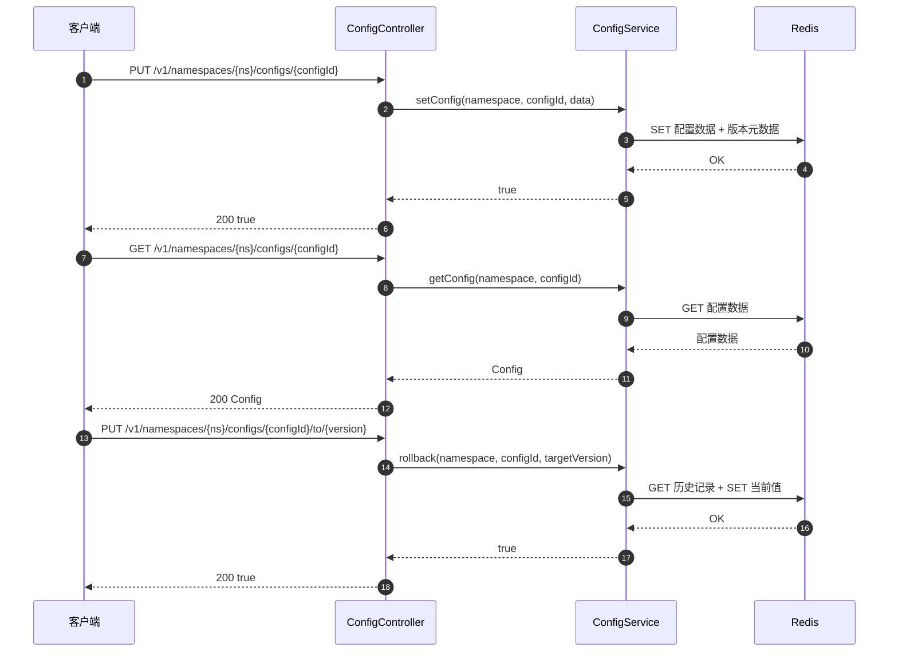
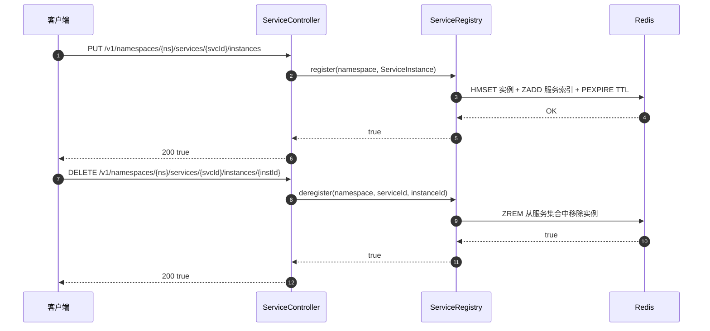
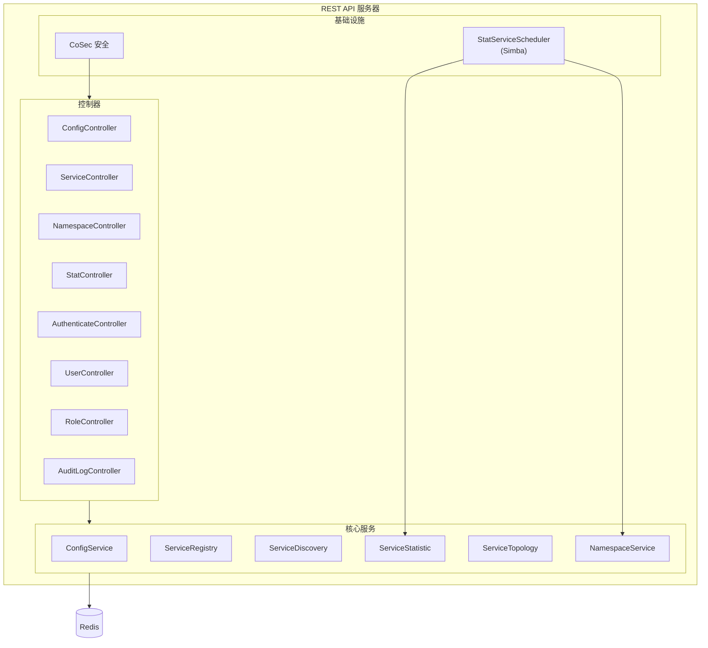

# REST API Server

CoSky REST API Server 是一个 Spring Boot WebFlux 应用程序，将全部微服务治理能力 -- 配置管理、服务发现与注册、命名空间管理、统计、拓扑和安全 -- 以响应式 HTTP 端点的形式暴露。它作为 CoSky Dashboard 和所有外部客户端的主要集成界面。

## 一览

| 组件 | 职责 | 关键文件 | 源码 |
|-----------|---------------|----------|--------|
| 服务器入口 | Spring Boot 应用引导 | `RestApiServer.kt` | [cosky-rest-api/.../RestApiServer.kt:23](https://github.com/Ahoo-Wang/CoSky/blob/main/cosky-rest-api/src/main/kotlin/me/ahoo/cosky/rest/RestApiServer.kt#L23) |
| 配置 API | 配置 CRUD、版本管理、导入/导出 | `ConfigController.kt` | [cosky-rest-api/.../ConfigController.kt:54](https://github.com/Ahoo-Wang/CoSky/blob/main/cosky-rest-api/src/main/kotlin/me/ahoo/cosky/rest/config/ConfigController.kt#L54) |
| 服务 API | 服务注册、发现、负载均衡 | `ServiceController.kt` | [cosky-rest-api/.../ServiceController.kt:40](https://github.com/Ahoo-Wang/CoSky/blob/main/cosky-rest-api/src/main/kotlin/me/ahoo/cosky/rest/service/ServiceController.kt#L40) |
| 命名空间 API | 多租户命名空间管理 | `NamespaceController.kt` | [cosky-rest-api/.../NamespaceController.kt:39](https://github.com/Ahoo-Wang/CoSky/blob/main/cosky-rest-api/src/main/kotlin/me/ahoo/cosky/rest/namespace/NamespaceController.kt#L39) |
| 统计 API | 服务统计和拓扑 | `StatController.kt` | [cosky-rest-api/.../StatController.kt:37](https://github.com/Ahoo-Wang/CoSky/blob/main/cosky-rest-api/src/main/kotlin/me/ahoo/cosky/rest/stat/StatController.kt#L37) |
| 统计调度器 | 分布式定时统计聚合 | `StatServiceScheduler.kt` | [cosky-rest-api/.../StatServiceScheduler.kt:33](https://github.com/Ahoo-Wang/CoSky/blob/main/cosky-rest-api/src/main/kotlin/me/ahoo/cosky/rest/stat/StatServiceScheduler.kt#L33) |

## 服务器入口

`RestApiServer` 是一个标准的 `@SpringBootApplication` 类。`main` 函数委托给 `SpringApplication.run`，它会自动配置 WebFlux 服务器、CoSky 发现、Redis 连接和安全组件。

```kotlin
@SpringBootApplication
class RestApiServer

fun main(args: Array<String>) {
    SpringApplication.run(RestApiServer::class.java, *args)
}
```

源码: [cosky-rest-api/.../RestApiServer.kt:23-28](https://github.com/Ahoo-Wang/CoSky/blob/main/cosky-rest-api/src/main/kotlin/me/ahoo/cosky/rest/RestApiServer.kt#L23)

## API 端点

所有端点共享 `/v1` 前缀。以下表格按领域分组。

### 配置端点

| 方法 | 路径 | 描述 | 控制器方法 | 源码 |
|--------|------|-------------|-------------------|--------|
| GET | `/v1/namespaces/{namespace}/configs` | 列出所有配置 ID | `getConfigs` | [ConfigController.kt:65](https://github.com/Ahoo-Wang/CoSky/blob/main/cosky-rest-api/src/main/kotlin/me/ahoo/cosky/rest/config/ConfigController.kt#L65) |
| PUT | `/v1/namespaces/{namespace}/configs/{configId}` | 创建或更新配置 | `setConfig` | [ConfigController.kt:168](https://github.com/Ahoo-Wang/CoSky/blob/main/cosky-rest-api/src/main/kotlin/me/ahoo/cosky/rest/config/ConfigController.kt#L168) |
| DELETE | `/v1/namespaces/{namespace}/configs/{configId}` | 删除配置 | `removeConfig` | [ConfigController.kt:177](https://github.com/Ahoo-Wang/CoSky/blob/main/cosky-rest-api/src/main/kotlin/me/ahoo/cosky/rest/config/ConfigController.kt#L177) |
| GET | `/v1/namespaces/{namespace}/configs/{configId}` | 获取配置内容 | `getConfig` | [ConfigController.kt:182](https://github.com/Ahoo-Wang/CoSky/blob/main/cosky-rest-api/src/main/kotlin/me/ahoo/cosky/rest/config/ConfigController.kt#L182) |
| PUT | `/v1/namespaces/{namespace}/configs/{configId}/to/{targetVersion}` | 回滚到目标版本 | `rollback` | [ConfigController.kt:187](https://github.com/Ahoo-Wang/CoSky/blob/main/cosky-rest-api/src/main/kotlin/me/ahoo/cosky/rest/config/ConfigController.kt#L187) |
| GET | `/v1/namespaces/{namespace}/configs/{configId}/versions` | 列出配置版本历史 | `getConfigVersions` | [ConfigController.kt:196](https://github.com/Ahoo-Wang/CoSky/blob/main/cosky-rest-api/src/main/kotlin/me/ahoo/cosky/rest/config/ConfigController.kt#L196) |
| GET | `/v1/namespaces/{namespace}/configs/{configId}/versions/{version}` | 获取特定版本的数据 | `getConfigHistory` | [ConfigController.kt:204](https://github.com/Ahoo-Wang/CoSky/blob/main/cosky-rest-api/src/main/kotlin/me/ahoo/cosky/rest/config/ConfigController.kt#L204) |
| POST | `/v1/namespaces/{namespace}/configs` (multipart) | 从 ZIP 导入配置 | `importZip` | [ConfigController.kt:69](https://github.com/Ahoo-Wang/CoSky/blob/main/cosky-rest-api/src/main/kotlin/me/ahoo/cosky/rest/config/ConfigController.kt#L69) |
| GET | `/v1/namespaces/{namespace}/configs/export` | 导出所有配置为 ZIP | `exportZip` | [ConfigController.kt:150](https://github.com/Ahoo-Wang/CoSky/blob/main/cosky-rest-api/src/main/kotlin/me/ahoo/cosky/rest/config/ConfigController.kt#L150) |

### 服务端点

| 方法 | 路径 | 描述 | 控制器方法 | 源码 |
|--------|------|-------------|-------------------|--------|
| GET | `/v1/namespaces/{namespace}/services` | 列出所有服务 ID | `getServices` | [ServiceController.kt:47](https://github.com/Ahoo-Wang/CoSky/blob/main/cosky-rest-api/src/main/kotlin/me/ahoo/cosky/rest/service/ServiceController.kt#L47) |
| PUT | `/v1/namespaces/{namespace}/services/{serviceId}` | 创建服务条目 | `setService` | [ServiceController.kt:52](https://github.com/Ahoo-Wang/CoSky/blob/main/cosky-rest-api/src/main/kotlin/me/ahoo/cosky/rest/service/ServiceController.kt#L52) |
| DELETE | `/v1/namespaces/{namespace}/services/{serviceId}` | 移除服务 | `removeService` | [ServiceController.kt:57](https://github.com/Ahoo-Wang/CoSky/blob/main/cosky-rest-api/src/main/kotlin/me/ahoo/cosky/rest/service/ServiceController.kt#L57) |
| GET | `/v1/namespaces/{namespace}/services/{serviceId}/instances` | 列出服务实例 | `getInstances` | [ServiceController.kt:62](https://github.com/Ahoo-Wang/CoSky/blob/main/cosky-rest-api/src/main/kotlin/me/ahoo/cosky/rest/service/ServiceController.kt#L62) |
| PUT | `/v1/namespaces/{namespace}/services/{serviceId}/instances` | 注册服务实例 | `register` | [ServiceController.kt:67](https://github.com/Ahoo-Wang/CoSky/blob/main/cosky-rest-api/src/main/kotlin/me/ahoo/cosky/rest/service/ServiceController.kt#L67) |
| DELETE | `/v1/namespaces/{namespace}/services/{serviceId}/instances/{instanceId}` | 注销服务实例 | `deregister` | [ServiceController.kt:76](https://github.com/Ahoo-Wang/CoSky/blob/main/cosky-rest-api/src/main/kotlin/me/ahoo/cosky/rest/service/ServiceController.kt#L76) |
| PUT | `/v1/namespaces/{namespace}/services/{serviceId}/instances/{instanceId}/metadata` | 设置实例元数据 | `setMetadata` | [ServiceController.kt:84](https://github.com/Ahoo-Wang/CoSky/blob/main/cosky-rest-api/src/main/kotlin/me/ahoo/cosky/rest/service/ServiceController.kt#L84) |
| GET | `/v1/namespaces/{namespace}/services/stats` | 获取服务统计 | `getServiceStats` | [ServiceController.kt:95](https://github.com/Ahoo-Wang/CoSky/blob/main/cosky-rest-api/src/main/kotlin/me/ahoo/cosky/rest/service/ServiceController.kt#L95) |
| GET | `/v1/namespaces/{namespace}/services/{serviceId}/lb` | 负载均衡选择实例 | `choose` | [ServiceController.kt:100](https://github.com/Ahoo-Wang/CoSky/blob/main/cosky-rest-api/src/main/kotlin/me/ahoo/cosky/rest/service/ServiceController.kt#L100) |

### 命名空间端点

| 方法 | 路径 | 描述 | 控制器方法 | 源码 |
|--------|------|-------------|-------------------|--------|
| GET | `/v1/namespaces` | 列出命名空间（按角色范围） | `getNamespaces` | [NamespaceController.kt:41](https://github.com/Ahoo-Wang/CoSky/blob/main/cosky-rest-api/src/main/kotlin/me/ahoo/cosky/rest/namespace/NamespaceController.kt#L41) |
| GET | `/v1/namespaces/current` | 获取当前上下文命名空间 | `current` | [NamespaceController.kt:52](https://github.com/Ahoo-Wang/CoSky/blob/main/cosky-rest-api/src/main/kotlin/me/ahoo/cosky/rest/namespace/NamespaceController.kt#L52) |
| PUT | `/v1/namespaces/current/{namespace}` | 设置当前上下文命名空间 | `setCurrentContextNamespace` | [NamespaceController.kt:57](https://github.com/Ahoo-Wang/CoSky/blob/main/cosky-rest-api/src/main/kotlin/me/ahoo/cosky/rest/namespace/NamespaceController.kt#L57) |
| PUT | `/v1/namespaces/{namespace}` | 创建命名空间 | `setNamespace` | [NamespaceController.kt:62](https://github.com/Ahoo-Wang/CoSky/blob/main/cosky-rest-api/src/main/kotlin/me/ahoo/cosky/rest/namespace/NamespaceController.kt#L62) |
| DELETE | `/v1/namespaces/{namespace}` | 移除命名空间 | `removeNamespace` | [NamespaceController.kt:67](https://github.com/Ahoo-Wang/CoSky/blob/main/cosky-rest-api/src/main/kotlin/me/ahoo/cosky/rest/namespace/NamespaceController.kt#L67) |

### 统计端点

| 方法 | 路径 | 描述 | 控制器方法 | 源码 |
|--------|------|-------------|-------------------|--------|
| GET | `/v1/namespaces/{namespace}/stat` | 聚合命名空间统计 | `getStat` | [StatController.kt:44](https://github.com/Ahoo-Wang/CoSky/blob/main/cosky-rest-api/src/main/kotlin/me/ahoo/cosky/rest/stat/StatController.kt#L44) |
| GET | `/v1/namespaces/{namespace}/stat/topology` | 获取服务依赖拓扑 | `getTopology` | [StatController.kt:74](https://github.com/Ahoo-Wang/CoSky/blob/main/cosky-rest-api/src/main/kotlin/me/ahoo/cosky/rest/stat/StatController.kt#L74) |

### 认证端点

| 方法 | 路径 | 描述 | 控制器方法 | 源码 |
|--------|------|-------------|-------------------|--------|
| POST | `/v1/authenticate/{username}/login` | 使用密码登录 | `login` | [AuthenticateController.kt:37](https://github.com/Ahoo-Wang/CoSky/blob/main/cosky-rest-api/src/main/kotlin/me/ahoo/cosky/rest/security/authentication/AuthenticateController.kt#L37) |
| POST | `/v1/authenticate/{username}/refresh` | 刷新访问令牌 | `refresh` | [AuthenticateController.kt:47](https://github.com/Ahoo-Wang/CoSky/blob/main/cosky-rest-api/src/main/kotlin/me/ahoo/cosky/rest/security/authentication/AuthenticateController.kt#L47) |

### 用户端点

| 方法 | 路径 | 描述 | 控制器方法 | 源码 |
|--------|------|-------------|-------------------|--------|
| GET | `/v1/users` | 列出所有用户及其角色 | `query` | [UserController.kt:42](https://github.com/Ahoo-Wang/CoSky/blob/main/cosky-rest-api/src/main/kotlin/me/ahoo/cosky/rest/security/user/UserController.kt#L42) |
| POST | `/v1/users/{username}` | 添加新用户 | `addUser` | [UserController.kt:52](https://github.com/Ahoo-Wang/CoSky/blob/main/cosky-rest-api/src/main/kotlin/me/ahoo/cosky/rest/security/user/UserController.kt#L52) |
| DELETE | `/v1/users/{username}` | 移除用户 | `removeUser` | [UserController.kt:62](https://github.com/Ahoo-Wang/CoSky/blob/main/cosky-rest-api/src/main/kotlin/me/ahoo/cosky/rest/security/user/UserController.kt#L62) |
| PATCH | `/v1/users/{username}/password` | 修改密码 | `changePwd` | [UserController.kt:47](https://github.com/Ahoo-Wang/CoSky/blob/main/cosky-rest-api/src/main/kotlin/me/ahoo/cosky/rest/security/user/UserController.kt#L47) |
| PATCH | `/v1/users/{username}/role` | 绑定角色到用户 | `bindRole` | [UserController.kt:57](https://github.com/Ahoo-Wang/CoSky/blob/main/cosky-rest-api/src/main/kotlin/me/ahoo/cosky/rest/security/user/UserController.kt#L57) |
| DELETE | `/v1/users/{username}/unlock` | 解锁被锁定的用户 | `unlock` | [UserController.kt:67](https://github.com/Ahoo-Wang/CoSky/blob/main/cosky-rest-api/src/main/kotlin/me/ahoo/cosky/rest/security/user/UserController.kt#L67) |

### 角色端点

| 方法 | 路径 | 描述 | 控制器方法 | 源码 |
|--------|------|-------------|-------------------|--------|
| GET | `/v1/roles` | 列出所有角色 | `allRole` | [RoleController.kt:38](https://github.com/Ahoo-Wang/CoSky/blob/main/cosky-rest-api/src/main/kotlin/me/ahoo/cosky/rest/security/rbac/RoleController.kt#L38) |
| GET | `/v1/roles/{roleName}/bind` | 获取资源-操作绑定 | `getResourceBind` | [RoleController.kt:43](https://github.com/Ahoo-Wang/CoSky/blob/main/cosky-rest-api/src/main/kotlin/me/ahoo/cosky/rest/security/rbac/RoleController.kt#L43) |
| PUT | `/v1/roles/{roleName}` | 创建或更新角色 | `saveRole` | [RoleController.kt:52](https://github.com/Ahoo-Wang/CoSky/blob/main/cosky-rest-api/src/main/kotlin/me/ahoo/cosky/rest/security/rbac/RoleController.kt#L52) |
| DELETE | `/v1/roles/{roleName}` | 移除角色 | `removeRole` | [RoleController.kt:57](https://github.com/Ahoo-Wang/CoSky/blob/main/cosky-rest-api/src/main/kotlin/me/ahoo/cosky/rest/security/rbac/RoleController.kt#L57) |

### 审计日志端点

| 方法 | 路径 | 描述 | 控制器方法 | 源码 |
|--------|------|-------------|-------------------|--------|
| GET | `/v1/audit-log` | 查询审计日志 | `queryLog` | [AuditLogController.kt:32](https://github.com/Ahoo-Wang/CoSky/blob/main/cosky-rest-api/src/main/kotlin/me/ahoo/cosky/rest/security/audit/AuditLogController.kt#L32) |

## 时序图

### 配置 CRUD 操作



<!-- Sources: cosky-rest-api/src/main/kotlin/me/ahoo/cosky/rest/config/ConfigController.kt:54, cosky-rest-api/src/main/kotlin/me/ahoo/cosky/rest/config/ConfigController.kt:168 -->

### 通过 REST 进行服务注册



<!-- Sources: cosky-rest-api/src/main/kotlin/me/ahoo/cosky/rest/service/ServiceController.kt:67, cosky-rest-api/src/main/kotlin/me/ahoo/cosky/rest/service/ServiceController.kt:76 -->

## 架构



<!-- Sources: cosky-rest-api/src/main/kotlin/me/ahoo/cosky/rest/RestApiServer.kt:23, cosky-rest-api/src/main/kotlin/me/ahoo/cosky/rest/stat/StatServiceScheduler.kt:33, cosky-rest-api/src/main/kotlin/me/ahoo/cosky/rest/stat/StatController.kt:37 -->

## StatServiceScheduler

`StatServiceScheduler` 是由 [Simba](https://github.com/Ahoo-Wang/Simba)（分布式互斥/领导者选举库）驱动的分布式定时任务。它继承 `AbstractScheduler` 并实现 Spring 的 `SmartLifecycle`，以便随应用上下文一起启动和停止。

关键行为：

- **基于互斥的领导者选举**：集群中只有一个实例持有 `"stat"` 互斥锁并执行工作。
- **调度计划**：初始延迟 1 秒后运行，之后每 10 秒运行一次（`ScheduleConfig.delay(1s, 10s)`）。
- **命名空间遍历**：每次触发时遍历所有命名空间，调用 `ServiceStatistic.statService()` 将服务指标聚合到 Redis。
- **当前命名空间保护**：确保当前上下文命名空间始终存在于命名空间列表中。

源码: [cosky-rest-api/.../StatServiceScheduler.kt:33-84](https://github.com/Ahoo-Wang/CoSky/blob/main/cosky-rest-api/src/main/kotlin/me/ahoo/cosky/rest/stat/StatServiceScheduler.kt#L33)

## 配置

REST API 服务器通过 `application.yaml` 进行配置。主要设置：

```yaml
cosky:
  security:
    enabled: true                    # 启用/禁用安全
    audit-log:
      action: write                  # 审计日志过滤："write"、"read" 或 "rw"
    enforce-init-super-user: false   # 启动时强制重新初始化超级用户

cosec:
  jwt:
    algorithm: hmac256               # JWT 签名算法
    secret: ${cosky.security.key}    # JWT 密钥
    token-validity:
      access: 15m                    # 访问令牌 TTL
      refresh: 3H                    # 刷新令牌 TTL

cosid:
  namespace: ${spring.application.name}
  machine:
    enabled: true
    distributor:
      type: redis
  generator:
    enabled: true

simba:
  redis:
    enabled: true                    # 通过 Redis 启用 Simba 分布式调度器
```

源码: [cosky-rest-api/src/main/resources/application.yaml](https://github.com/Ahoo-Wang/CoSky/blob/main/cosky-rest-api/src/main/resources/application.yaml)

## 相关页面

- [安全与 RBAC](/guide/security-rbac) -- 认证、授权和基于角色的访问控制
- [Dashboard](/guide/dashboard) -- CoSky 管理 UI

## 参考

- [RestApiServer.kt](https://github.com/Ahoo-Wang/CoSky/blob/main/cosky-rest-api/src/main/kotlin/me/ahoo/cosky/rest/RestApiServer.kt)
- [ConfigController.kt](https://github.com/Ahoo-Wang/CoSky/blob/main/cosky-rest-api/src/main/kotlin/me/ahoo/cosky/rest/config/ConfigController.kt)
- [ServiceController.kt](https://github.com/Ahoo-Wang/CoSky/blob/main/cosky-rest-api/src/main/kotlin/me/ahoo/cosky/rest/service/ServiceController.kt)
- [NamespaceController.kt](https://github.com/Ahoo-Wang/CoSky/blob/main/cosky-rest-api/src/main/kotlin/me/ahoo/cosky/rest/namespace/NamespaceController.kt)
- [StatController.kt](https://github.com/Ahoo-Wang/CoSky/blob/main/cosky-rest-api/src/main/kotlin/me/ahoo/cosky/rest/stat/StatController.kt)
- [StatServiceScheduler.kt](https://github.com/Ahoo-Wang/CoSky/blob/main/cosky-rest-api/src/main/kotlin/me/ahoo/cosky/rest/stat/StatServiceScheduler.kt)
- [RequestPathPrefix.kt](https://github.com/Ahoo-Wang/CoSky/blob/main/cosky-rest-api/src/main/kotlin/me/ahoo/cosky/rest/support/RequestPathPrefix.kt)
- [application.yaml](https://github.com/Ahoo-Wang/CoSky/blob/main/cosky-rest-api/src/main/resources/application.yaml)
