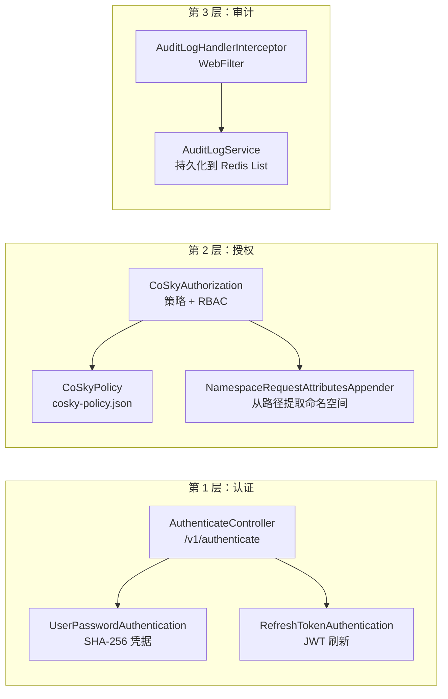
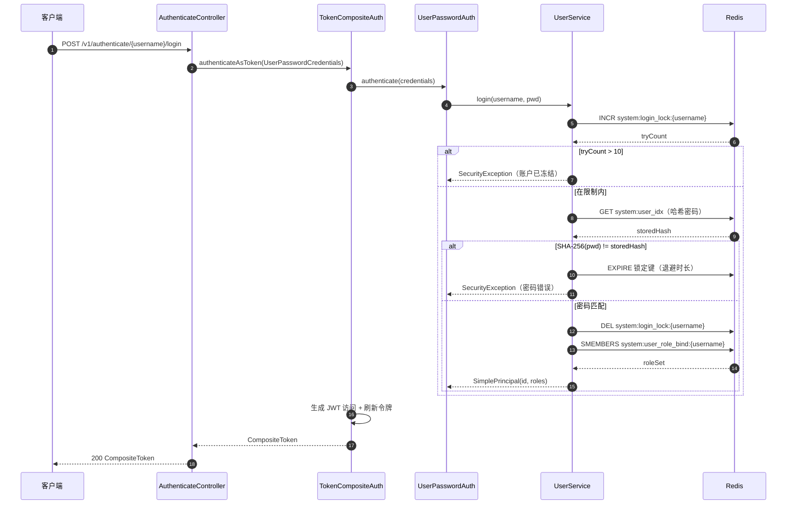
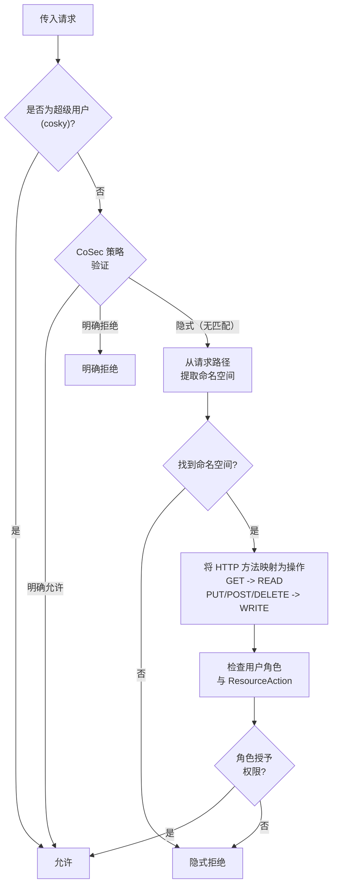
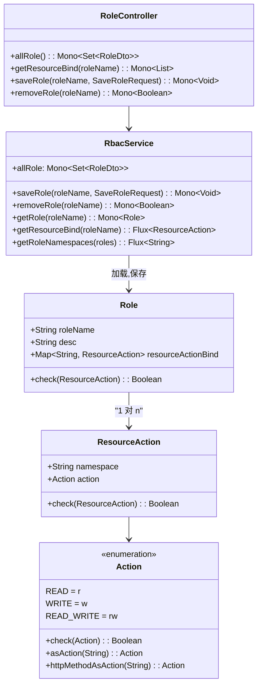

# 安全与 RBAC

CoSky 实现了全面的三层安全模型 -- **认证**、**授权**和**审计** -- 基于 [CoSec](https://github.com/Ahoo-Wang/CoSec) 安全框架构建。用户凭据使用 SHA-256 哈希存储在 Redis 中。授权结合了策略引擎（CoSec 策略 JSON）和命名空间范围的 RBAC。所有操作都会被审计并持久化到 Redis List 中以供查询。

## 一览

| 层级 | 组件 | 职责 | 关键文件 | 源码 |
|-------|-----------|---------------|----------|--------|
| 认证 | `UserPasswordAuthentication` | 通过用户名/密码登录 | `UserPasswordAuthentication.kt` | [security/.../UserPasswordAuthentication.kt:11](https://github.com/Ahoo-Wang/CoSky/blob/main/cosky-rest-api/src/main/kotlin/me/ahoo/cosky/rest/security/authentication/UserPasswordAuthentication.kt#L11) |
| 认证 | `RefreshTokenAuthentication` | 刷新 JWT 令牌对 | `RefreshTokenAuthentication.kt` | [security/.../RefreshTokenAuthentication.kt:14](https://github.com/Ahoo-Wang/CoSky/blob/main/cosky-rest-api/src/main/kotlin/me/ahoo/cosky/rest/security/authentication/RefreshTokenAuthentication.kt#L14) |
| 授权 | `CoSkyAuthorization` | 双层授权（策略 + RBAC） | `CoSkyAuthorization.kt` | [security/.../CoSkyAuthorization.kt:19](https://github.com/Ahoo-Wang/CoSky/blob/main/cosky-rest-api/src/main/kotlin/me/ahoo/cosky/rest/security/authorization/CoSkyAuthorization.kt#L19) |
| RBAC | `RbacService` | Redis 中的角色/资源 CRUD | `RbacService.kt` | [security/.../RbacService.kt:30](https://github.com/Ahoo-Wang/CoSky/blob/main/cosky-rest-api/src/main/kotlin/me/ahoo/cosky/rest/security/rbac/RbacService.kt#L30) |
| 审计 | `AuditLogHandlerInterceptor` | 用于审计日志的 WebFilter | `AuditLogHandlerInterceptor.kt` | [security/.../AuditLogHandlerInterceptor.kt:31](https://github.com/Ahoo-Wang/CoSky/blob/main/cosky-rest-api/src/main/kotlin/me/ahoo/cosky/rest/security/audit/AuditLogHandlerInterceptor.kt#L31) |
| 用户管理 | `UserService` | 用户 CRUD、登录锁定、角色绑定 | `UserService.kt` | [security/.../UserService.kt:36](https://github.com/Ahoo-Wang/CoSky/blob/main/cosky-rest-api/src/main/kotlin/me/ahoo/cosky/rest/security/user/UserService.kt#L36) |

## 三层安全架构



<!-- Sources: cosky-rest-api/src/main/kotlin/me/ahoo/cosky/rest/security/authentication/UserPasswordAuthentication.kt:11, cosky-rest-api/src/main/kotlin/me/ahoo/cosky/rest/security/authentication/RefreshTokenAuthentication.kt:14, cosky-rest-api/src/main/kotlin/me/ahoo/cosky/rest/security/authorization/CoSkyAuthorization.kt:19, cosky-rest-api/src/main/kotlin/me/ahoo/cosky/rest/security/audit/AuditLogHandlerInterceptor.kt:31 -->

## 认证

CoSky 支持两种认证方式：

1. **UserPasswordAuthentication** -- 使用 SHA-256 哈希凭据（存储在 Redis 中）验证用户名/密码。成功时，`UserService.login()` 方法返回包含用户角色绑定的 `SimplePrincipal`。
2. **RefreshTokenAuthentication** -- 接受访问/刷新令牌对，并通过 CoSec 的 `TokenVerifier` 验证刷新令牌。成功时返回新的令牌对。

### AuthenticateController 端点

| 方法 | 路径 | 描述 | 源码 |
|--------|------|-------------|--------|
| POST | `/v1/authenticate/{username}/login` | 使用密码登录 | [AuthenticateController.kt:37](https://github.com/Ahoo-Wang/CoSky/blob/main/cosky-rest-api/src/main/kotlin/me/ahoo/cosky/rest/security/authentication/AuthenticateController.kt#L37) |
| POST | `/v1/authenticate/{username}/refresh` | 刷新令牌对 | [AuthenticateController.kt:47](https://github.com/Ahoo-Wang/CoSky/blob/main/cosky-rest-api/src/main/kotlin/me/ahoo/cosky/rest/security/authentication/AuthenticateController.kt#L47) |

### 登录锁定机制

`UserService.login()` 实现了渐进式账户锁定以防止暴力破解攻击：

- **最大失败次数**：10 次（`MAX_LOGIN_ERROR_TIMES`）
- **基础锁定时长**：15 分钟（`LOGIN_LOCK_EXPIRE`）
- **最大锁定时长**：3 天（`MAX_LOGIN_LOCK_EXPIRE`）
- **指数退避**：`lockoutDuration = baseLockout * max(tryCount / maxErrorTimes, 1)`，不超过最大值。
- **锁定追踪**：Redis 键（`system:login_lock:{username}`）在每次失败尝试时递增，在成功登录时删除。
- **解锁**：管理员可通过 `DELETE /v1/users/{username}/unlock` 解锁用户。

源码: [UserService.kt:135-177](https://github.com/Ahoo-Wang/CoSky/blob/main/cosky-rest-api/src/main/kotlin/me/ahoo/cosky/rest/security/user/UserService.kt#L135)

### 登录流程



<!-- Sources: cosky-rest-api/src/main/kotlin/me/ahoo/cosky/rest/security/authentication/AuthenticateController.kt:37, cosky-rest-api/src/main/kotlin/me/ahoo/cosky/rest/security/authentication/UserPasswordAuthentication.kt:11, cosky-rest-api/src/main/kotlin/me/ahoo/cosky/rest/security/user/UserService.kt:135 -->

## 授权

CoSky 使用 `CoSkyAuthorization` 实现的**双层授权模型**：

1. **第 1 层 -- 基于策略**：CoSec 策略引擎根据 `cosky-policy.json` 评估请求。如果策略明确允许该请求，则立即通过。如果明确拒绝，则被拒绝。
2. **第 2 层 -- RBAC**：如果策略结果为隐式（既不允许也不拒绝），系统落入命名空间范围的 RBAC。它通过 `NamespaceRequestAttributesAppender` 从请求路径中提取命名空间，然后检查用户的角色是否授予了在该命名空间上所需的操作权限。

超级用户（`cosky`）绕过所有授权检查。

源码: [CoSkyAuthorization.kt:24-60](https://github.com/Ahoo-Wang/CoSky/blob/main/cosky-rest-api/src/main/kotlin/me/ahoo/cosky/rest/security/authorization/CoSkyAuthorization.kt#L24)

### 授权决策流程



<!-- Sources: cosky-rest-api/src/main/kotlin/me/ahoo/cosky/rest/security/authorization/CoSkyAuthorization.kt:24, cosky-rest-api/src/main/kotlin/me/ahoo/cosky/rest/security/authorization/NamespaceRequestAttributesAppender.kt:11 -->

### CoSkyPolicy 和 InitialPolicyLoader

`CoSkyPolicy` 从 CoSky 自身的配置服务加载安全策略。策略存储在 `system` 命名空间中的配置项中。它订阅配置变更事件，并在更新时自动刷新策略缓存。

如果配置服务中不存在策略，`InitialPolicyLoader` 会从 classpath 加载内置的 `cosky-policy.json` 作为回退。

源码: [CoSkyPolicy.kt:17](https://github.com/Ahoo-Wang/CoSky/blob/main/cosky-rest-api/src/main/kotlin/me/ahoo/cosky/rest/security/authorization/CoSkyPolicy.kt#L17), [InitialPolicyLoader.kt:7](https://github.com/Ahoo-Wang/CoSky/blob/main/cosky-rest-api/src/main/kotlin/me/ahoo/cosky/rest/security/authorization/InitialPolicyLoader.kt#L7)

## RBAC 模型

CoSky 实现了命名空间范围的基于角色的访问控制模型：

- **角色** -- 拥有名称、描述以及命名空间到 `ResourceAction` 绑定的映射。
- **ResourceAction** -- 将 `namespace` 与 `Action` 枚举值配对。
- **Action** -- 可以是 `READ`（`r`）、`WRITE`（`w`）或 `READ_WRITE`（`rw`）。HTTP 方法映射为：`GET/OPTIONS/TRACE/HEAD` 映射为 `READ`；`POST/PUT/DELETE/PATCH` 映射为 `WRITE`。

内置的 `admin` 角色没有资源-操作绑定，作为系统保留角色拥有最高权限级别（由策略授予完全访问权限）。



<!-- Sources: cosky-rest-api/src/main/kotlin/me/ahoo/cosky/rest/security/rbac/Role.kt:20, cosky-rest-api/src/main/kotlin/me/ahoo/cosky/rest/security/rbac/ResourceAction.kt:22, cosky-rest-api/src/main/kotlin/me/ahoo/cosky/rest/security/rbac/Action.kt:22, cosky-rest-api/src/main/kotlin/me/ahoo/cosky/rest/security/rbac/RbacService.kt:30 -->

### 超级用户和管理员角色

- **超级用户**：`cosky` 用户（root）绕过所有授权。当 `cosky.security.enforce-init-super-user` 为 `true` 时，由 `SecurityCommand` 在应用启动时初始化。会生成一个随机 10 字符密码并打印到标准输出。
- **管理员角色**：`admin` 角色是系统保留角色，由策略引擎的 `admin` 语句授予完全访问权限。它会自动包含在角色列表中。

源码: [UserService.kt:38-52](https://github.com/Ahoo-Wang/CoSky/blob/main/cosky-rest-api/src/main/kotlin/me/ahoo/cosky/rest/security/user/UserService.kt#L38), [Role.kt:31-34](https://github.com/Ahoo-Wang/CoSky/blob/main/cosky-rest-api/src/main/kotlin/me/ahoo/cosky/rest/security/rbac/Role.kt#L31), [SecurityCommand.kt:25](https://github.com/Ahoo-Wang/CoSky/blob/main/cosky-rest-api/src/main/kotlin/me/ahoo/cosky/rest/security/SecurityCommand.kt#L25)

## 审计日志

### AuditLogHandlerInterceptor

`AuditLogHandlerInterceptor` 是一个响应式 `WebFilter`，拦截所有 HTTP 请求。在响应写入后，它创建包含以下内容的 `AuditLog` 条目：

- **operator** -- 用户名（来自安全上下文，或从登录路径提取）
- **ip** -- 远程地址
- **path** -- 请求 URI
- **action** -- HTTP 方法名
- **status** -- HTTP 响应状态码
- **msg** -- 错误消息（如有）
- **opTime** -- 毫秒级时间戳

该过滤器可通过 `SecurityProperties.auditLog.action` 配置。默认仅审计 `WRITE` 操作。设置为 `READ_WRITE`（`rw`）可审计所有操作，设置为 `READ`（`r`）可仅审计读操作。

源码: [AuditLogHandlerInterceptor.kt:31-76](https://github.com/Ahoo-Wang/CoSky/blob/main/cosky-rest-api/src/main/kotlin/me/ahoo/cosky/rest/security/audit/AuditLogHandlerInterceptor.kt#L31)

### AuditLogService

`AuditLogService` 将审计日志条目以 JSON 字符串的形式持久化到 Redis List（`system:audit:log`）中。新条目推入头部（`leftPush`）。查询支持通过 `range` 进行偏移/限制分页。

源码: [AuditLogService.kt:27-51](https://github.com/Ahoo-Wang/CoSky/blob/main/cosky-rest-api/src/main/kotlin/me/ahoo/cosky/rest/security/audit/AuditLogService.kt#L27)

## 用户管理

### UserService

`UserService` 完全在 Redis 中管理用户：

- **用户索引**：Redis Hash（`system:user_idx`），将用户名映射到 SHA-256 密码哈希。
- **角色绑定**：Redis Set（`system:user_role_bind:{username}`），存储分配给每个用户的角色名称。
- **密码哈希**：使用 Guava 的 `Hashing.sha256()` 进行 UTF-8 编码。
- **登录锁定**：参见上方[登录锁定机制](#登录锁定机制)。
- **Root 初始化**：`initRoot(enforce)` 使用随机密码创建或重置 `cosky` 超级用户。

源码: [UserService.kt:36-212](https://github.com/Ahoo-Wang/CoSky/blob/main/cosky-rest-api/src/main/kotlin/me/ahoo/cosky/rest/security/user/UserService.kt#L36)

### SecurityCommand

`SecurityCommand` 是一个在应用启动时运行的 `CommandLineRunner`。它调用 `UserService.initRoot()` 来初始化超级用户。当 `cosky.security.enforce-init-super-user` 设置为 `true` 时会自动执行。

源码: [SecurityCommand.kt:25-34](https://github.com/Ahoo-Wang/CoSky/blob/main/cosky-rest-api/src/main/kotlin/me/ahoo/cosky/rest/security/SecurityCommand.kt#L25)

### UserController 端点

| 方法 | 路径 | 描述 | 源码 |
|--------|------|-------------|--------|
| GET | `/v1/users` | 列出所有用户及其角色绑定 | [UserController.kt:42](https://github.com/Ahoo-Wang/CoSky/blob/main/cosky-rest-api/src/main/kotlin/me/ahoo/cosky/rest/security/user/UserController.kt#L42) |
| POST | `/v1/users/{username}` | 创建新用户 | [UserController.kt:52](https://github.com/Ahoo-Wang/CoSky/blob/main/cosky-rest-api/src/main/kotlin/me/ahoo/cosky/rest/security/user/UserController.kt#L52) |
| DELETE | `/v1/users/{username}` | 移除用户 | [UserController.kt:62](https://github.com/Ahoo-Wang/CoSky/blob/main/cosky-rest-api/src/main/kotlin/me/ahoo/cosky/rest/security/user/UserController.kt#L62) |
| PATCH | `/v1/users/{username}/password` | 修改密码 | [UserController.kt:47](https://github.com/Ahoo-Wang/CoSky/blob/main/cosky-rest-api/src/main/kotlin/me/ahoo/cosky/rest/security/user/UserController.kt#L47) |
| PATCH | `/v1/users/{username}/role` | 绑定角色到用户 | [UserController.kt:57](https://github.com/Ahoo-Wang/CoSky/blob/main/cosky-rest-api/src/main/kotlin/me/ahoo/cosky/rest/security/user/UserController.kt#L57) |
| DELETE | `/v1/users/{username}/unlock` | 解锁被锁定的用户 | [UserController.kt:67](https://github.com/Ahoo-Wang/CoSky/blob/main/cosky-rest-api/src/main/kotlin/me/ahoo/cosky/rest/security/user/UserController.kt#L67) |

## 默认安全策略

内置的 `cosky-policy.json` 定义了基准安全策略。其语句按顺序评估：

```json
{
  "statements": [
    { "name": "options",       "action": { "all": { "method": "OPTIONS" } } },
    { "name": "swaggerUI",     "action": { "path": { "method": "GET", "pattern": ["/swagger-ui/**", ...] } } },
    { "name": "dashboard",     "action": { "path": { "method": "GET", "pattern": ["/", "/index.html", ...] } } },
    { "name": "actuatorHealth","action": ["/actuator/health", "/actuator/health/*"] },
    { "name": "authenticate",  "action": ["/v1/authenticate/{username}/login", "/v1/authenticate/{username}/refresh"] },
    { "name": "namespace",     "action": { "path": { "method": "GET", "pattern": "/v1/namespaces/**" } },
                              "condition": { "authenticated": {} } },
    { "name": "admin",         "action": "*", "condition": { "inRole": { "value": "admin" } } },
    { "name": "root",          "action": "*", "condition": { "eq": { "part": "context.principal.id", "value": "cosky" } } }
  ]
}
```

关键策略规则：

- **未认证访问**：OPTIONS 请求、Swagger UI、静态 Dashboard 资源、Actuator 健康检查和认证端点无需登录即可访问。
- **命名空间读取**：任何已认证用户都可以读取命名空间数据（GET `/v1/namespaces/**`）。
- **管理员角色**：`admin` 角色成员拥有对所有 API 的不受限制访问（`action: "*"`）。
- **Root 用户**：`cosky` 用户无论角色绑定如何，都拥有不受限制的访问权限。

源码: [cosky-rest-api/src/main/resources/cosky-policy.json](https://github.com/Ahoo-Wang/CoSky/blob/main/cosky-rest-api/src/main/resources/cosky-policy.json)

## 相关页面

- [REST API Server](/guide/rest-api) -- API 端点和服务器架构
- [Dashboard](/guide/dashboard) -- CoSky 管理 UI

## 参考

- [SecurityProperties.kt](https://github.com/Ahoo-Wang/CoSky/blob/main/cosky-rest-api/src/main/kotlin/me/ahoo/cosky/rest/security/SecurityProperties.kt)
- [AuthenticateController.kt](https://github.com/Ahoo-Wang/CoSky/blob/main/cosky-rest-api/src/main/kotlin/me/ahoo/cosky/rest/security/authentication/AuthenticateController.kt)
- [UserPasswordAuthentication.kt](https://github.com/Ahoo-Wang/CoSky/blob/main/cosky-rest-api/src/main/kotlin/me/ahoo/cosky/rest/security/authentication/UserPasswordAuthentication.kt)
- [RefreshTokenAuthentication.kt](https://github.com/Ahoo-Wang/CoSky/blob/main/cosky-rest-api/src/main/kotlin/me/ahoo/cosky/rest/security/authentication/RefreshTokenAuthentication.kt)
- [CoSkyAuthorization.kt](https://github.com/Ahoo-Wang/CoSky/blob/main/cosky-rest-api/src/main/kotlin/me/ahoo/cosky/rest/security/authorization/CoSkyAuthorization.kt)
- [CoSkyPolicy.kt](https://github.com/Ahoo-Wang/CoSky/blob/main/cosky-rest-api/src/main/kotlin/me/ahoo/cosky/rest/security/authorization/CoSkyPolicy.kt)
- [InitialPolicyLoader.kt](https://github.com/Ahoo-Wang/CoSky/blob/main/cosky-rest-api/src/main/kotlin/me/ahoo/cosky/rest/security/authorization/InitialPolicyLoader.kt)
- [NamespaceRequestAttributesAppender.kt](https://github.com/Ahoo-Wang/CoSky/blob/main/cosky-rest-api/src/main/kotlin/me/ahoo/cosky/rest/security/authorization/NamespaceRequestAttributesAppender.kt)
- [RbacService.kt](https://github.com/Ahoo-Wang/CoSky/blob/main/cosky-rest-api/src/main/kotlin/me/ahoo/cosky/rest/security/rbac/RbacService.kt)
- [Role.kt](https://github.com/Ahoo-Wang/CoSky/blob/main/cosky-rest-api/src/main/kotlin/me/ahoo/cosky/rest/security/rbac/Role.kt)
- [Action.kt](https://github.com/Ahoo-Wang/CoSky/blob/main/cosky-rest-api/src/main/kotlin/me/ahoo/cosky/rest/security/rbac/Action.kt)
- [ResourceAction.kt](https://github.com/Ahoo-Wang/CoSky/blob/main/cosky-rest-api/src/main/kotlin/me/ahoo/cosky/rest/security/rbac/ResourceAction.kt)
- [UserService.kt](https://github.com/Ahoo-Wang/CoSky/blob/main/cosky-rest-api/src/main/kotlin/me/ahoo/cosky/rest/security/user/UserService.kt)
- [SecurityCommand.kt](https://github.com/Ahoo-Wang/CoSky/blob/main/cosky-rest-api/src/main/kotlin/me/ahoo/cosky/rest/security/SecurityCommand.kt)
- [AuditLogService.kt](https://github.com/Ahoo-Wang/CoSky/blob/main/cosky-rest-api/src/main/kotlin/me/ahoo/cosky/rest/security/audit/AuditLogService.kt)
- [AuditLogHandlerInterceptor.kt](https://github.com/Ahoo-Wang/CoSky/blob/main/cosky-rest-api/src/main/kotlin/me/ahoo/cosky/rest/security/audit/AuditLogHandlerInterceptor.kt)
- [cosky-policy.json](https://github.com/Ahoo-Wang/CoSky/blob/main/cosky-rest-api/src/main/resources/cosky-policy.json)
