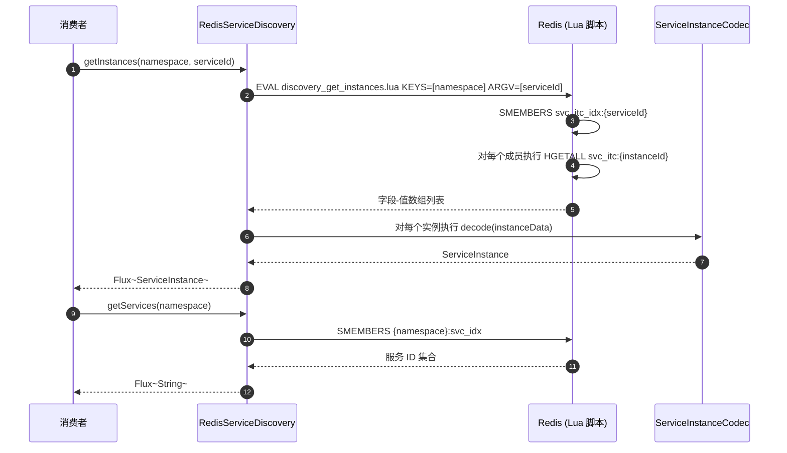
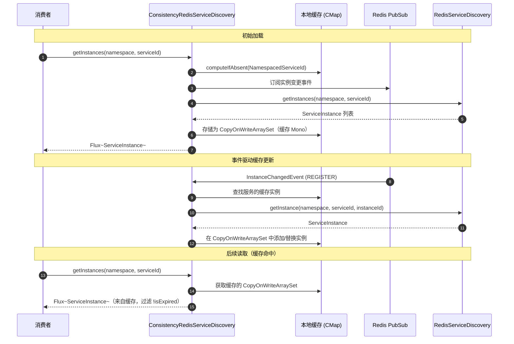
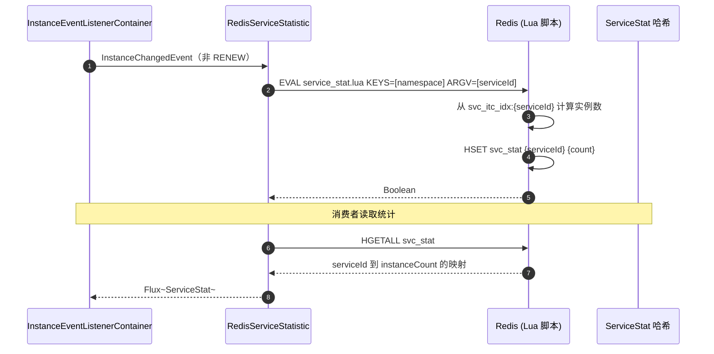
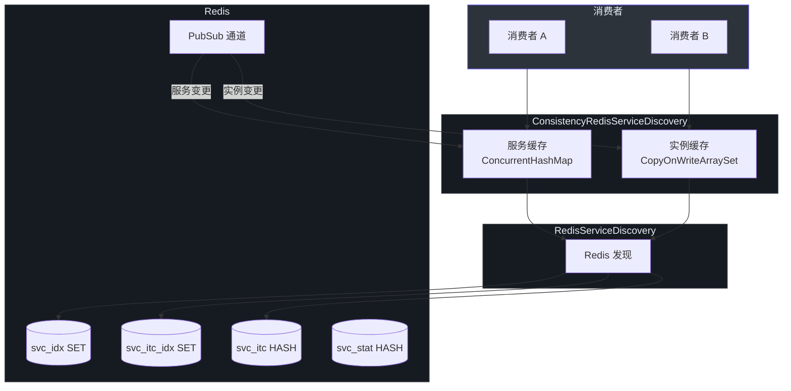

# 服务发现

CoSky 的服务发现层使消费者能够在运行时定位可用的服务实例。它提供了标准的 Redis 支持的发现路径和基于 Redis PubSub 维护本地状态的高性能一致性缓存层，延迟几乎为零。一致性层在基准测试中 `getInstances` 达到 76M+ ops/s，`getServices` 达到 455M+ ops/s。

| 方面 | 详情 |
|---|---|
| **接口** | `ServiceDiscovery` |
| **标准实现** | `RedisServiceDiscovery` |
| **一致性层** | `ConsistencyRedisServiceDiscovery` |
| **统计** | `RedisServiceStatistic` |
| **一致性机制** | 本地缓存 + Redis PubSub 事件驱动更新 |
| **并发模型** | 响应式（`Flux<ServiceInstance>`、`Mono<ServiceInstance>`） |

## ServiceDiscovery 接口

[`ServiceDiscovery`](https://github.com/Ahoo-Wang/CoSky/blob/main/cosky-discovery/src/main/kotlin/me/ahoo/cosky/discovery/ServiceDiscovery.kt) 接口定义了四个用于定位服务和实例的核心操作。

| 方法 | 返回类型 | 描述 | 源码 |
|---|---|---|---|
| `getServices` | `Flux<String>` | 列出命名空间中所有已注册的服务 ID | [ServiceDiscovery.kt:25](https://github.com/Ahoo-Wang/CoSky/blob/main/cosky-discovery/src/main/kotlin/me/ahoo/cosky/discovery/ServiceDiscovery.kt#L25) |
| `getInstances` | `Flux<ServiceInstance>` | 列出指定服务 ID 的所有实例 | [ServiceDiscovery.kt:26](https://github.com/Ahoo-Wang/CoSky/blob/main/cosky-discovery/src/main/kotlin/me/ahoo/cosky/discovery/ServiceDiscovery.kt#L26) |
| `getInstance` | `Mono<ServiceInstance>` | 通过服务 ID 和实例 ID 获取特定实例 | [ServiceDiscovery.kt:27](https://github.com/Ahoo-Wang/CoSky/blob/main/cosky-discovery/src/main/kotlin/me/ahoo/cosky/discovery/ServiceDiscovery.kt#L27) |
| `getInstanceTtl` | `Mono<Long>` | 返回特定实例的 TTL 过期时间戳 | [ServiceDiscovery.kt:33](https://github.com/Ahoo-Wang/CoSky/blob/main/cosky-discovery/src/main/kotlin/me/ahoo/cosky/discovery/ServiceDiscovery.kt#L33) |

## RedisServiceDiscovery

[`RedisServiceDiscovery`](https://github.com/Ahoo-Wang/CoSky/blob/main/cosky-discovery/src/main/kotlin/me/ahoo/cosky/discovery/redis/RedisServiceDiscovery.kt) 是标准实现，每次请求都直接从 Redis 读取实例数据：

- `getServices` 使用 `SMEMBERS` 从 `svc_idx` SET 读取 ([RedisServiceDiscovery.kt:89](https://github.com/Ahoo-Wang/CoSky/blob/main/cosky-discovery/src/main/kotlin/me/ahoo/cosky/discovery/redis/RedisServiceDiscovery.kt#L89))。
- `getInstances` 执行 `discovery_get_instances.lua` Lua 脚本，从 `svc_itc_idx:{serviceId}` SET 读取所有实例键并返回其哈希数据 ([RedisServiceDiscovery.kt:39](https://github.com/Ahoo-Wang/CoSky/blob/main/cosky-discovery/src/main/kotlin/me/ahoo/cosky/discovery/redis/RedisServiceDiscovery.kt#L39))。
- `getInstance` 执行 `discovery_get_instance.lua` 获取单个实例的哈希字段 ([RedisServiceDiscovery.kt:56](https://github.com/Ahoo-Wang/CoSky/blob/main/cosky-discovery/src/main/kotlin/me/ahoo/cosky/discovery/redis/RedisServiceDiscovery.kt#L56))。
- 所有结果使用 [`ServiceInstanceCodec.decode`](https://github.com/Ahoo-Wang/CoSky/blob/main/cosky-discovery/src/main/kotlin/me/ahoo/cosky/discovery/ServiceInstanceCodec.kt#L57) 解码。

## ConsistencyRedisServiceDiscovery

[`ConsistencyRedisServiceDiscovery`](https://github.com/Ahoo-Wang/CoSky/blob/main/cosky-discovery/src/main/kotlin/me/ahoo/cosky/discovery/redis/ConsistencyRedisServiceDiscovery.kt) 包装任意 `ServiceDiscovery` 委托者，并添加通过 Redis PubSub 事件通知保持一致的本地缓存层。这是推荐的生产环境实现。

### 架构

一致性层维护两个 `ConcurrentHashMap` 缓存：
- `namespaceMapServices`：按命名空间缓存服务列表，通过服务变更事件失效 ([ConsistencyRedisServiceDiscovery.kt:57](https://github.com/Ahoo-Wang/CoSky/blob/main/cosky-discovery/src/main/kotlin/me/ahoo/cosky/discovery/redis/ConsistencyRedisServiceDiscovery.kt#L57))。
- `serviceMapInstances`：按 `NamespacedServiceId` 缓存实例，通过实例变更事件增量更新 ([ConsistencyRedisServiceDiscovery.kt:54](https://github.com/Ahoo-Wang/CoSky/blob/main/cosky-discovery/src/main/kotlin/me/ahoo/cosky/discovery/redis/ConsistencyRedisServiceDiscovery.kt#L54))。

### 事件驱动缓存更新

当实例发生变更（注册、注销、续约、设置元数据、过期）时，[`InstanceChangedEvent`](https://github.com/Ahoo-Wang/CoSky/blob/main/cosky-discovery/src/main/kotlin/me/ahoo/cosky/discovery/InstanceChangedEvent.kt) 处理器将变更应用到本地缓存：

| 事件 | 缓存操作 |
|---|---|
| `REGISTER` | 从委托者获取完整实例，添加到缓存集合 |
| `RENEW` | 从委托者获取 TTL，更新缓存实例的 `ttlAt` |
| `SET_METADATA` | 从委托者获取完整实例，替换缓存集合中的条目 |
| `DEREGISTER` | 从缓存集合中移除 |
| `EXPIRED` | 从缓存集合中移除 |

这种增量方式避免了每次变更时的全量缓存重建 ([ConsistencyRedisServiceDiscovery.kt:138](https://github.com/Ahoo-Wang/CoSky/blob/main/cosky-discovery/src/main/kotlin/me/ahoo/cosky/discovery/redis/ConsistencyRedisServiceDiscovery.kt#L138))。

### 性能

一致性层通过从内存提供读取，大幅提升了吞吐量：

| 操作 | 标准 Redis | 一致性层 | 提升 |
|---|---|---|---|
| `getInstances` | ~226K ops/s | 76M+ ops/s | ~338 倍 |
| `getServices` | ~304K ops/s | 455M+ ops/s | ~1,495 倍 |
| 延迟 (p99) | 可变（受网络限制） | 亚微秒级 | 确定性 |

## ServiceStatistic

[`ServiceStatistic`](https://github.com/Ahoo-Wang/CoSky/blob/main/cosky-discovery/src/main/kotlin/me/ahoo/cosky/discovery/ServiceStatistic.kt) 接口提供服务级别统计：

| 方法 | 返回类型 | 描述 |
|---|---|---|
| `statService(namespace)` | `Mono<Void>` | 触发所有服务的统计重新计算 |
| `statService(namespace, serviceId)` | `Mono<Void>` | 触发特定服务的统计重新计算 |
| `getServiceStats(namespace)` | `Flux<ServiceStat>` | 返回所有服务统计（服务 ID + 实例数） |
| `getInstanceCount(namespace)` | `Mono<Long>` | 返回所有服务的实例总数 |

[`RedisServiceStatistic`](https://github.com/Ahoo-Wang/CoSky/blob/main/cosky-discovery/src/main/kotlin/me/ahoo/cosky/discovery/redis/RedisServiceStatistic.kt) 通过执行 Lua 脚本并监听实例变更事件来实现。它过滤掉 `RENEW` 事件，因为续约不会改变实例数 ([RedisServiceStatistic.kt:56](https://github.com/Ahoo-Wang/CoSky/blob/main/cosky-discovery/src/main/kotlin/me/ahoo/cosky/discovery/redis/RedisServiceStatistic.kt#L56))。

每个 [`ServiceStat`](https://github.com/Ahoo-Wang/CoSky/blob/main/cosky-discovery/src/main/kotlin/me/ahoo/cosky/discovery/ServiceStat.kt) 包含：
- `serviceId: String` -- 服务标识符
- `instanceCount: Int` -- 已注册实例数

## 时序图

### 服务查询流程（标准模式）

<!-- Sources: cosky-discovery/src/main/kotlin/me/ahoo/cosky/discovery/redis/RedisServiceDiscovery.kt:33, cosky-discovery/src/main/kotlin/me/ahoo/cosky/discovery/redis/RedisServiceDiscovery.kt:89, cosky-discovery/src/main/resources/discovery_get_instances.lua -->

### 一致性缓存更新流程

<!-- Sources: cosky-discovery/src/main/kotlin/me/ahoo/cosky/discovery/redis/ConsistencyRedisServiceDiscovery.kt:86, cosky-discovery/src/main/kotlin/me/ahoo/cosky/discovery/redis/ConsistencyRedisServiceDiscovery.kt:138, cosky-discovery/src/main/kotlin/me/ahoo/cosky/discovery/redis/ConsistencyRedisServiceDiscovery.kt:54 -->

### 统计收集流程

<!-- Sources: cosky-discovery/src/main/kotlin/me/ahoo/cosky/discovery/redis/RedisServiceStatistic.kt:52, cosky-discovery/src/main/kotlin/me/ahoo/cosky/discovery/redis/RedisServiceStatistic.kt:96, cosky-discovery/src/main/resources/service_stat.lua -->

## 架构图

<!-- Sources: cosky-discovery/src/main/kotlin/me/ahoo/cosky/discovery/redis/ConsistencyRedisServiceDiscovery.kt:43, cosky-discovery/src/main/kotlin/me/ahoo/cosky/discovery/redis/RedisServiceDiscovery.kt:29, cosky-discovery/src/main/kotlin/me/ahoo/cosky/discovery/DiscoveryKeyGenerator.kt:22 -->

## 相关页面

- [服务注册](./service-registry) -- 实例如何注册和保活
- [负载均衡](./load-balancers) -- 如何选择已发现的实例
- [服务拓扑](./service-topology) -- 如何跟踪服务依赖关系

## 参考文献

- [ServiceDiscovery.kt](https://github.com/Ahoo-Wang/CoSky/blob/main/cosky-discovery/src/main/kotlin/me/ahoo/cosky/discovery/ServiceDiscovery.kt)
- [RedisServiceDiscovery.kt](https://github.com/Ahoo-Wang/CoSky/blob/main/cosky-discovery/src/main/kotlin/me/ahoo/cosky/discovery/redis/RedisServiceDiscovery.kt)
- [ConsistencyRedisServiceDiscovery.kt](https://github.com/Ahoo-Wang/CoSky/blob/main/cosky-discovery/src/main/kotlin/me/ahoo/cosky/discovery/redis/ConsistencyRedisServiceDiscovery.kt)
- [ServiceStatistic.kt](https://github.com/Ahoo-Wang/CoSky/blob/main/cosky-discovery/src/main/kotlin/me/ahoo/cosky/discovery/ServiceStatistic.kt)
- [RedisServiceStatistic.kt](https://github.com/Ahoo-Wang/CoSky/blob/main/cosky-discovery/src/main/kotlin/me/ahoo/cosky/discovery/redis/RedisServiceStatistic.kt)
- [ServiceStat.kt](https://github.com/Ahoo-Wang/CoSky/blob/main/cosky-discovery/src/main/kotlin/me/ahoo/cosky/discovery/ServiceStat.kt)
- [InstanceChangedEvent.kt](https://github.com/Ahoo-Wang/CoSky/blob/main/cosky-discovery/src/main/kotlin/me/ahoo/cosky/discovery/InstanceChangedEvent.kt)
- [ServiceInstanceCodec.kt](https://github.com/Ahoo-Wang/CoSky/blob/main/cosky-discovery/src/main/kotlin/me/ahoo/cosky/discovery/ServiceInstanceCodec.kt)
- [DiscoveryKeyGenerator.kt](https://github.com/Ahoo-Wang/CoSky/blob/main/cosky-discovery/src/main/kotlin/me/ahoo/cosky/discovery/DiscoveryKeyGenerator.kt)
- [discovery_get_instances.lua](https://github.com/Ahoo-Wang/CoSky/blob/main/cosky-discovery/src/main/resources/discovery_get_instances.lua)
- [discovery_get_instance.lua](https://github.com/Ahoo-Wang/CoSky/blob/main/cosky-discovery/src/main/resources/discovery_get_instance.lua)
