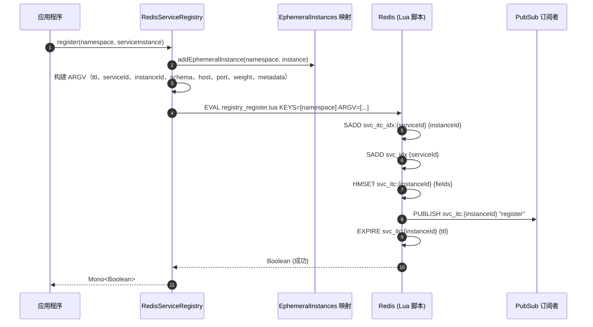
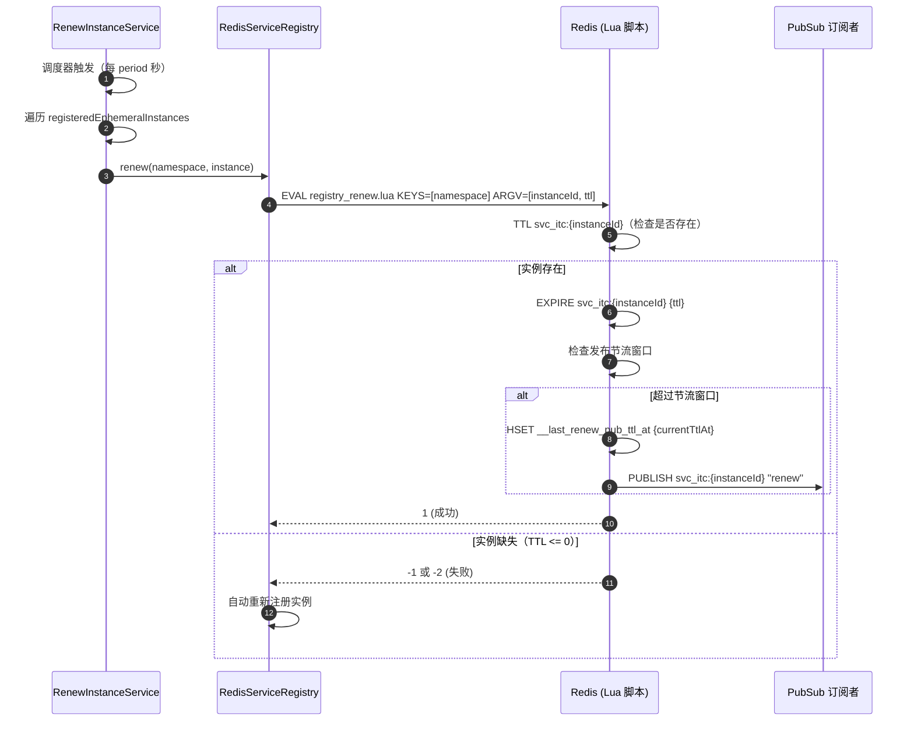
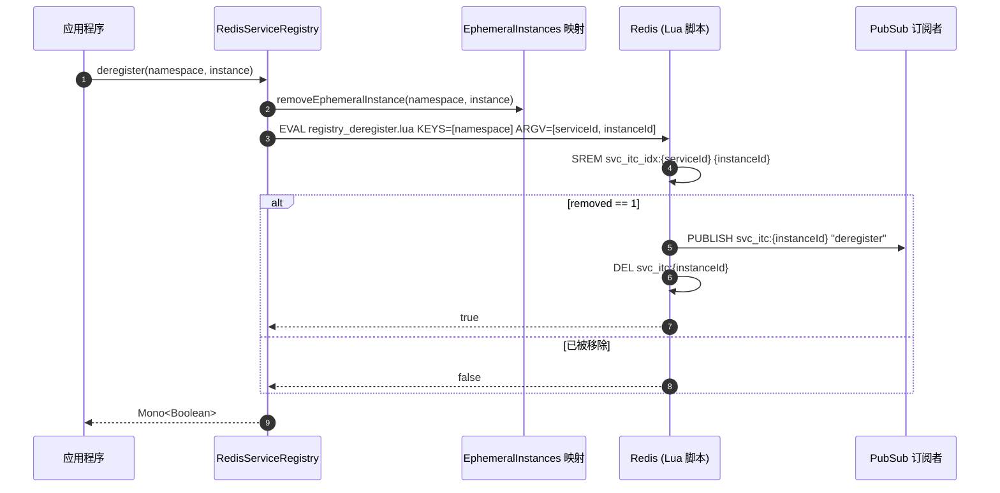
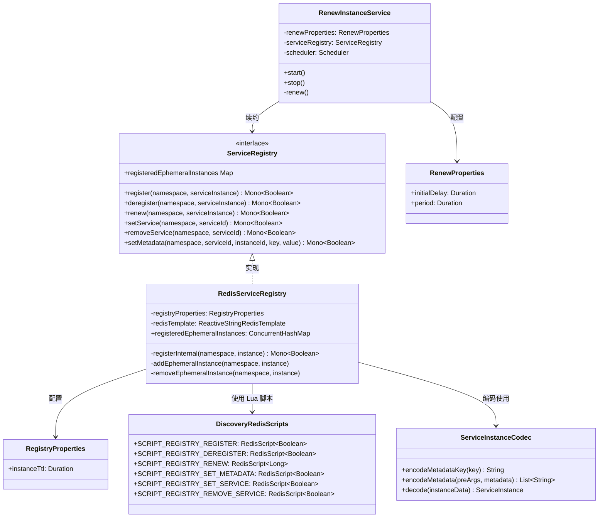

# 服务注册

CoSky 的服务注册管理微服务集群中服务实例的生命周期。基于 Redis 和 Lua 脚本，它提供原子性、无竞态条件的注册、注销、心跳续约和元数据管理——所有操作都在多租户命名空间模型下运行。

| 方面 | 详情 |
|---|---|
| **接口** | `ServiceRegistry` |
| **Redis 实现** | `RedisServiceRegistry` |
| **存储引擎** | Redis Hash + Set + Lua 脚本 |
| **并发模型** | 响应式（`Mono<Boolean>`） |
| **心跳** | `RenewInstanceService`（定时保活） |
| **序列化** | `ServiceInstanceCodec` |

## ServiceRegistry 接口

[`ServiceRegistry`](https://github.com/Ahoo-Wang/CoSky/blob/main/cosky-discovery/src/main/kotlin/me/ahoo/cosky/discovery/ServiceRegistry.kt) 接口定义了所有注册操作的契约。

| 方法 | 返回类型 | 描述 | 源码 |
|---|---|---|---|
| `register` | `Mono<Boolean>` | 注册服务实例，可选 TTL | [ServiceRegistry.kt:33](https://github.com/Ahoo-Wang/CoSky/blob/main/cosky-discovery/src/main/kotlin/me/ahoo/cosky/discovery/ServiceRegistry.kt#L33) |
| `deregister` | `Mono<Boolean>` | 从注册中心移除服务实例 | [ServiceRegistry.kt:43](https://github.com/Ahoo-Wang/CoSky/blob/main/cosky-discovery/src/main/kotlin/me/ahoo/cosky/discovery/ServiceRegistry.kt#L43) |
| `renew` | `Mono<Boolean>` | 续约/延长临时实例的 TTL | [ServiceRegistry.kt:41](https://github.com/Ahoo-Wang/CoSky/blob/main/cosky-discovery/src/main/kotlin/me/ahoo/cosky/discovery/ServiceRegistry.kt#L41) |
| `setService` | `Mono<Boolean>` | 在命名空间索引中创建命名服务条目 | [ServiceRegistry.kt:24](https://github.com/Ahoo-Wang/CoSky/blob/main/cosky-discovery/src/main/kotlin/me/ahoo/cosky/discovery/ServiceRegistry.kt#L24) |
| `removeService` | `Mono<Boolean>` | 从命名空间索引中移除命名服务 | [ServiceRegistry.kt:25](https://github.com/Ahoo-Wang/CoSky/blob/main/cosky-discovery/src/main/kotlin/me/ahoo/cosky/discovery/ServiceRegistry.kt#L25) |
| `setMetadata` | `Mono<Boolean>` | 设置服务实例的元数据键值对 | [ServiceRegistry.kt:53](https://github.com/Ahoo-Wang/CoSky/blob/main/cosky-discovery/src/main/kotlin/me/ahoo/cosky/discovery/ServiceRegistry.kt#L53) |

## ServiceInstance 数据模型

[`ServiceInstance`](https://github.com/Ahoo-Wang/CoSky/blob/main/cosky-discovery/src/main/kotlin/me/ahoo/cosky/discovery/ServiceInstance.kt) 继承基础 [`Instance`](https://github.com/Ahoo-Wang/CoSky/blob/main/cosky-discovery/src/main/kotlin/me/ahoo/cosky/discovery/Instance.kt) 接口，包含以下字段：

| 字段 | 类型 | 默认值 | 描述 |
|---|---|---|---|
| `instanceId` | `String` | -- | 唯一标识符：`{serviceId}@{schema}#{host}#{port}` |
| `serviceId` | `String` | -- | 逻辑服务名称 |
| `schema` | `String` | -- | 协议模式（`http`、`https` 等） |
| `host` | `String` | -- | 主机地址 |
| `port` | `Int` | -- | 端口号 |
| `weight` | `Int` | `1` | 负载均衡权重 |
| `isEphemeral` | `Boolean` | `true` | 临时实例会过期；持久实例不会 |
| `ttlAt` | `Long` | `TTL_AT_FOREVER (-1)` | 绝对 TTL 过期时间戳（纪元秒） |
| `metadata` | `Map<String, String>` | `emptyMap()` | 附加到实例的任意键值元数据 |

`ServiceInstance` 上的 `isExpired` 属性将 `ttlAt` 与当前系统时间比较，以确定临时实例是否已过期 ([ServiceInstance.kt:34](https://github.com/Ahoo-Wang/CoSky/blob/main/cosky-discovery/src/main/kotlin/me/ahoo/cosky/discovery/ServiceInstance.kt#L34))。

### ServiceInstanceCodec 序列化

[`ServiceInstanceCodec`](https://github.com/Ahoo-Wang/CoSky/blob/main/cosky-discovery/src/main/kotlin/me/ahoo/cosky/discovery/ServiceInstanceCodec.kt) 负责实例数据与 Redis 哈希字段之间的编码和解码。它使用 `_` 前缀表示元数据键，保留 `__` 用于系统元数据：

```kotlin
// 编码：元数据键 "version" 在 Redis 中变为 "_version"
fun encodeMetadataKey(key: String): String = METADATA_PREFIX + key
```

`decode` 函数 ([ServiceInstanceCodec.kt:57](https://github.com/Ahoo-Wang/CoSky/blob/main/cosky-discovery/src/main/kotlin/me/ahoo/cosky/discovery/ServiceInstanceCodec.kt#L57)) 将 Redis `HGETALL` 返回的扁平键值列表解析为 `ServiceInstance` 对象。

## Redis 实现

### RedisServiceRegistry

[`RedisServiceRegistry`](https://github.com/Ahoo-Wang/CoSky/blob/main/cosky-discovery/src/main/kotlin/me/ahoo/cosky/discovery/redis/RedisServiceRegistry.kt) 是 `ServiceRegistry` 的 Redis 实现。它使用 Lua 脚本进行原子操作，并维护已注册临时实例的内存映射：

```kotlin
class RedisServiceRegistry(
    private val registryProperties: RegistryProperties,
    private val redisTemplate: ReactiveStringRedisTemplate
) : ServiceRegistry
```

关键设计要点：
- 临时实例被跟踪在 `ConcurrentHashMap<NamespacedInstanceId, ServiceInstance>` 中，用于心跳续约 ([RedisServiceRegistry.kt:40](https://github.com/Ahoo-Wang/CoSky/blob/main/cosky-discovery/src/main/kotlin/me/ahoo/cosky/discovery/redis/RedisServiceRegistry.kt#L40))。
- `register` 方法在执行 Lua 脚本之前先将实例添加到临时映射 ([RedisServiceRegistry.kt:98](https://github.com/Ahoo-Wang/CoSky/blob/main/cosky-discovery/src/main/kotlin/me/ahoo/cosky/discovery/redis/RedisServiceRegistry.kt#L98))。
- 如果续约失败（实例键不存在），会自动重新注册实例 ([RedisServiceRegistry.kt:178](https://github.com/Ahoo-Wang/CoSky/blob/main/cosky-discovery/src/main/kotlin/me/ahoo/cosky/discovery/redis/RedisServiceRegistry.kt#L178))。

### DiscoveryRedisScripts

[`DiscoveryRedisScripts`](https://github.com/Ahoo-Wang/CoSky/blob/main/cosky-discovery/src/main/kotlin/me/ahoo/cosky/discovery/redis/DiscoveryRedisScripts.kt) 从类路径加载所有注册相关的 Lua 脚本：

| 脚本 | 资源文件 | 用途 |
|---|---|---|
| `SCRIPT_REGISTRY_REGISTER` | `registry_register.lua` | 原子实例注册 |
| `SCRIPT_REGISTRY_DEREGISTER` | `registry_deregister.lua` | 原子实例移除 |
| `SCRIPT_REGISTRY_RENEW` | `registry_renew.lua` | 带发布节流的 TTL 续约 |
| `SCRIPT_REGISTRY_SET_METADATA` | `registry_set_metadata.lua` | 设置实例元数据字段 |
| `SCRIPT_REGISTRY_SET_SERVICE` | `registry_set_service.lua` | 在命名空间索引中创建服务 |
| `SCRIPT_REGISTRY_REMOVE_SERVICE` | `registry_remove_service.lua` | 从命名空间索引中移除服务 |

### RegistryProperties

[`RegistryProperties`](https://github.com/Ahoo-Wang/CoSky/blob/main/cosky-discovery/src/main/kotlin/me/ahoo/cosky/discovery/RegistryProperties.kt) 配置默认实例 TTL：

| 属性 | 类型 | 默认值 | 描述 |
|---|---|---|---|
| `instanceTtl` | `Duration` | `1 minute` | 临时实例的生存时间 |

## RenewInstanceService（心跳）

[`RenewInstanceService`](https://github.com/Ahoo-Wang/CoSky/blob/main/cosky-discovery/src/main/kotlin/me/ahoo/cosky/discovery/RenewInstanceService.kt) 为临时实例提供保活机制。它在专用调度器（`CoSky-Renew`）上运行，定期续约所有已注册的临时实例：

| 属性 | 默认值 | 描述 |
|---|---|---|
| `initialDelay` | `1 second` | 首次续约周期前的延迟 |
| `period` | `10 seconds` | 续约周期间隔 |

续约周期必须小于 `RegistryProperties.instanceTtl`，以防止过早过期。该服务遍历所有 `registeredEphemeralInstances` 并通过 `ServiceRegistry` 对每个实例调用 `renew` ([RenewInstanceService.kt:70](https://github.com/Ahoo-Wang/CoSky/blob/main/cosky-discovery/src/main/kotlin/me/ahoo/cosky/discovery/RenewInstanceService.kt#L70))。

## 时序图

### 注册流程



<!-- Sources: cosky-discovery/src/main/resources/registry_register.lua, cosky-discovery/src/main/kotlin/me/ahoo/cosky/discovery/redis/RedisServiceRegistry.kt:43, cosky-discovery/src/main/kotlin/me/ahoo/cosky/discovery/redis/DiscoveryRedisScripts.kt:26 -->

### 续约 / 心跳流程



<!-- Sources: cosky-discovery/src/main/resources/registry_renew.lua, cosky-discovery/src/main/kotlin/me/ahoo/cosky/discovery/RenewInstanceService.kt:70, cosky-discovery/src/main/kotlin/me/ahoo/cosky/discovery/redis/RedisServiceRegistry.kt:160 -->

### 注销流程



<!-- Sources: cosky-discovery/src/main/resources/registry_deregister.lua, cosky-discovery/src/main/kotlin/me/ahoo/cosky/discovery/redis/RedisServiceRegistry.kt:188, cosky-discovery/src/main/kotlin/me/ahoo/cosky/discovery/redis/DiscoveryRedisScripts.kt:29 -->

## Redis 键结构

注册中心使用结构化的键模式，在每个命名空间内组织服务和实例数据：

| Redis 键 | 类型 | 用途 | 示例 |
|---|---|---|---|
| `{namespace}:svc_idx` | SET | 命名空间中所有服务 ID 的集合 | `production:svc_idx` |
| `{namespace}:svc_stat` | HASH | 服务 ID 到实例数统计 | `production:svc_stat` |
| `{namespace}:svc_itc_idx:{serviceId}` | SET | 指定服务的实例 ID 集合 | `production:svc_itc_idx:order-service` |
| `{namespace}:svc_itc:{instanceId}` | HASH | 实例数据（字段：instanceId、serviceId、schema、host、port、weight、ephemeral、ttl_at、metadata） | `production:svc_itc:order-service@http#10.0.1.5#8080` |
| `{namespace}:topology_idx` | HASH | 拓扑索引：消费者名称到时间戳 | `production:topology_idx` |
| `{namespace}:topology:{consumer}` | HASH | 拓扑依赖：生产者名称到时间戳 | `production:topology:gateway-service` |

实例 ID 格式为 `{serviceId}@{schema}#{host}#{port}`（例如 `order-service@http#10.0.1.5#8080`），由 [`Instance.asInstanceId`](https://github.com/Ahoo-Wang/CoSky/blob/main/cosky-discovery/src/main/kotlin/me/ahoo/cosky/discovery/Instance.kt#L57) 定义。

## 类图



<!-- Sources: cosky-discovery/src/main/kotlin/me/ahoo/cosky/discovery/ServiceRegistry.kt:23, cosky-discovery/src/main/kotlin/me/ahoo/cosky/discovery/redis/RedisServiceRegistry.kt:32, cosky-discovery/src/main/kotlin/me/ahoo/cosky/discovery/RegistryProperties.kt:22, cosky-discovery/src/main/kotlin/me/ahoo/cosky/discovery/RenewInstanceService.kt:34, cosky-discovery/src/main/kotlin/me/ahoo/cosky/discovery/RenewProperties.kt:22, cosky-discovery/src/main/kotlin/me/ahoo/cosky/discovery/redis/DiscoveryRedisScripts.kt:24 -->

## 相关页面

- [服务发现](./service-discovery) -- 客户端如何发现已注册的实例
- [负载均衡](./load-balancers) -- 如何从注册中心选择实例
- [服务拓扑](./service-topology) -- 如何构建服务依赖图

## 参考文献

- [ServiceRegistry.kt](https://github.com/Ahoo-Wang/CoSky/blob/main/cosky-discovery/src/main/kotlin/me/ahoo/cosky/discovery/ServiceRegistry.kt)
- [ServiceInstance.kt](https://github.com/Ahoo-Wang/CoSky/blob/main/cosky-discovery/src/main/kotlin/me/ahoo/cosky/discovery/ServiceInstance.kt)
- [ServiceInstanceCodec.kt](https://github.com/Ahoo-Wang/CoSky/blob/main/cosky-discovery/src/main/kotlin/me/ahoo/cosky/discovery/ServiceInstanceCodec.kt)
- [Instance.kt](https://github.com/Ahoo-Wang/CoSky/blob/main/cosky-discovery/src/main/kotlin/me/ahoo/cosky/discovery/Instance.kt)
- [RedisServiceRegistry.kt](https://github.com/Ahoo-Wang/CoSky/blob/main/cosky-discovery/src/main/kotlin/me/ahoo/cosky/discovery/redis/RedisServiceRegistry.kt)
- [DiscoveryRedisScripts.kt](https://github.com/Ahoo-Wang/CoSky/blob/main/cosky-discovery/src/main/kotlin/me/ahoo/cosky/discovery/redis/DiscoveryRedisScripts.kt)
- [RegistryProperties.kt](https://github.com/Ahoo-Wang/CoSky/blob/main/cosky-discovery/src/main/kotlin/me/ahoo/cosky/discovery/RegistryProperties.kt)
- [RenewInstanceService.kt](https://github.com/Ahoo-Wang/CoSky/blob/main/cosky-discovery/src/main/kotlin/me/ahoo/cosky/discovery/RenewInstanceService.kt)
- [RenewProperties.kt](https://github.com/Ahoo-Wang/CoSky/blob/main/cosky-discovery/src/main/kotlin/me/ahoo/cosky/discovery/RenewProperties.kt)
- [DiscoveryKeyGenerator.kt](https://github.com/Ahoo-Wang/CoSky/blob/main/cosky-discovery/src/main/kotlin/me/ahoo/cosky/discovery/DiscoveryKeyGenerator.kt)
- [registry_register.lua](https://github.com/Ahoo-Wang/CoSky/blob/main/cosky-discovery/src/main/resources/registry_register.lua)
- [registry_renew.lua](https://github.com/Ahoo-Wang/CoSky/blob/main/cosky-discovery/src/main/resources/registry_renew.lua)
- [registry_deregister.lua](https://github.com/Ahoo-Wang/CoSky/blob/main/cosky-discovery/src/main/resources/registry_deregister.lua)
