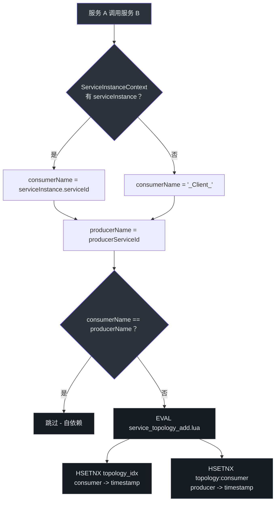
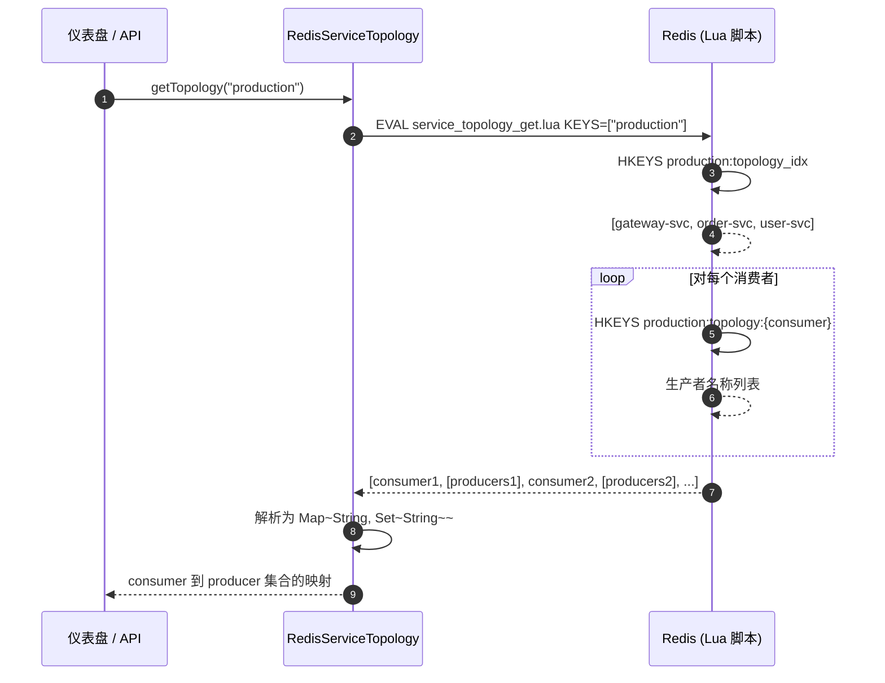
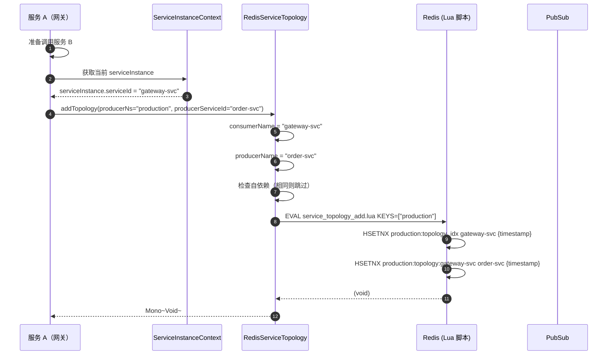
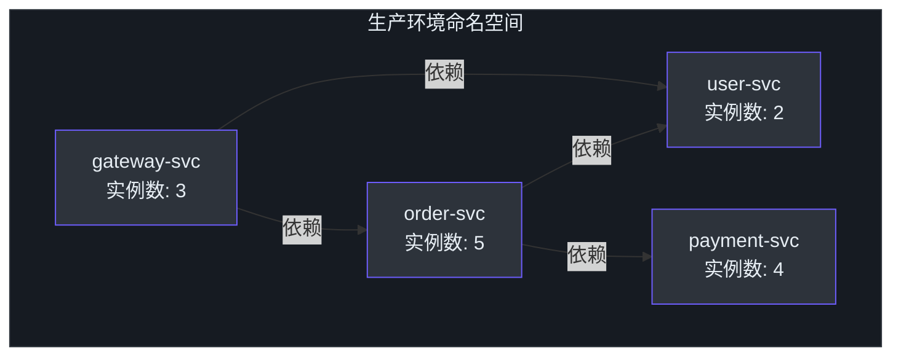
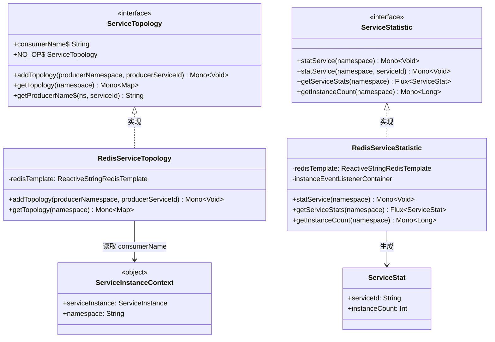

# 服务拓扑

CoSky 的服务拓扑模块自动构建微服务生态系统的依赖关系图。当一个服务调用另一个服务时，调用方身份（消费者）和目标方身份（生产者）会被记录在 Redis 中。这使您能够可视化哪些服务依赖于哪些服务、跟踪跨命名空间依赖关系以及监控服务级别的实例统计——所有这些都无需任何手动配置。

| 方面 | 详情 |
|---|---|
| **接口** | `ServiceTopology` |
| **Redis 实现** | `RedisServiceTopology` |
| **存储引擎** | Redis Hash（`topology_idx` + `topology:{consumer}`） |
| **消费者身份** | 来自 `ServiceInstanceContext.serviceInstance` |
| **并发模型** | 响应式（`Mono<Map<String, Set<String>>>`） |

## ServiceTopology 接口

[`ServiceTopology`](https://github.com/Ahoo-Wang/CoSky/blob/main/cosky-discovery/src/main/kotlin/me/ahoo/cosky/discovery/ServiceTopology.kt) 接口定义了两个操作：

| 方法 | 返回类型 | 描述 | 源码 |
|---|---|---|---|
| `addTopology` | `Mono<Void>` | 记录当前服务依赖某个生产者服务 | [ServiceTopology.kt:23](https://github.com/Ahoo-Wang/CoSky/blob/main/cosky-discovery/src/main/kotlin/me/ahoo/cosky/discovery/ServiceTopology.kt#L23) |
| `getTopology` | `Mono<Map<String, Set<String>>>` | 获取命名空间的完整拓扑图 | [ServiceTopology.kt:24](https://github.com/Ahoo-Wang/CoSky/blob/main/cosky-discovery/src/main/kotlin/me/ahoo/cosky/discovery/ServiceTopology.kt#L24) |

该接口还提供：
- 一个不执行任何操作的 `NO_OP` 单例，在禁用拓扑跟踪时使用 ([ServiceTopology.kt:27](https://github.com/Ahoo-Wang/CoSky/blob/main/cosky-discovery/src/main/kotlin/me/ahoo/cosky/discovery/ServiceTopology.kt#L27))。
- `consumerName` 派生自 `ServiceInstanceContext.serviceInstance.serviceId`，如果未注册实例则回退到 `"_Client_"` ([ServiceTopology.kt:39](https://github.com/Ahoo-Wang/CoSky/blob/main/cosky-discovery/src/main/kotlin/me/ahoo/cosky/discovery/ServiceTopology.kt#L39))。
- `getProducerName`，如果生产者位于不同命名空间，则添加命名空间前缀（例如 `"otherNs.order-service"`）([ServiceTopology.kt:48](https://github.com/Ahoo-Wang/CoSky/blob/main/cosky-discovery/src/main/kotlin/me/ahoo/cosky/discovery/ServiceTopology.kt#L48))。

## RedisServiceTopology

[`RedisServiceTopology`](https://github.com/Ahoo-Wang/CoSky/blob/main/cosky-discovery/src/main/kotlin/me/ahoo/cosky/discovery/redis/RedisServiceTopology.kt) 将拓扑数据存储在两个 Redis 哈希结构中：

### addTopology

`addTopology` 方法 ([RedisServiceTopology.kt:11](https://github.com/Ahoo-Wang/CoSky/blob/main/cosky-discovery/src/main/kotlin/me/ahoo/cosky/discovery/redis/RedisServiceTopology.kt#L11)) 执行 `service_topology_add.lua`，该脚本：
1. 将消费者名称记录到拓扑索引中：`HSETNX {namespace}:topology_idx {consumerName} {timestamp}`
2. 记录生产者依赖：`HSETNX {namespace}:topology:{consumerName} {producerName} {timestamp}`

自依赖（消费者 == 生产者）会被跳过 ([RedisServiceTopology.kt:15](https://github.com/Ahoo-Wang/CoSky/blob/main/cosky-discovery/src/main/kotlin/me/ahoo/cosky/discovery/redis/RedisServiceTopology.kt#L15))。

### getTopology

`getTopology` 方法 ([RedisServiceTopology.kt:26](https://github.com/Ahoo-Wang/CoSky/blob/main/cosky-discovery/src/main/kotlin/me/ahoo/cosky/discovery/redis/RedisServiceTopology.kt#L26)) 执行 `service_topology_get.lua`，该脚本：
1. 通过 `HKEYS` 从 `{namespace}:topology_idx` 读取所有消费者名称
2. 对每个消费者，通过 `HKEYS` 从 `{namespace}:topology:{consumerName}` 读取其依赖集合
3. 返回 `Map<String, Set<String>>` 结果——将每个消费者映射到其生产者集合

## 拓扑构建过程

<!-- Sources: cosky-discovery/src/main/kotlin/me/ahoo/cosky/discovery/ServiceTopology.kt:39, cosky-discovery/src/main/kotlin/me/ahoo/cosky/discovery/redis/RedisServiceTopology.kt:11, cosky-discovery/src/main/resources/service_topology_add.lua -->

## 时序图：拓扑查询流程

<!-- Sources: cosky-discovery/src/main/kotlin/me/ahoo/cosky/discovery/redis/RedisServiceTopology.kt:26, cosky-discovery/src/main/resources/service_topology_get.lua -->

## 时序图：拓扑记录流程

<!-- Sources: cosky-discovery/src/main/kotlin/me/ahoo/cosky/discovery/redis/RedisServiceTopology.kt:11, cosky-discovery/src/main/kotlin/me/ahoo/cosky/discovery/ServiceTopology.kt:48, cosky-discovery/src/main/kotlin/me/ahoo/cosky/discovery/ServiceInstanceContext.kt:23 -->

## Redis 键模式

| Redis 键 | 类型 | 用途 | Lua 脚本 |
|---|---|---|---|
| `{namespace}:topology_idx` | HASH | 消费者服务名称到首次出现时间戳的映射 | `service_topology_add.lua` |
| `{namespace}:topology:{consumer}` | HASH | 指定消费者的生产者服务名称到首次出现时间戳的映射 | `service_topology_add.lua` |

跨命名空间的生产者名称格式为 `{producerNamespace}.{producerServiceId}`，由 [`ServiceTopology.getProducerName`](https://github.com/Ahoo-Wang/CoSky/blob/main/cosky-discovery/src/main/kotlin/me/ahoo/cosky/discovery/ServiceTopology.kt#L48) 生成。这使得拓扑图能够区分不同命名空间中的同名服务。

## 服务统计集成

[`ServiceStat`](https://github.com/Ahoo-Wang/CoSky/blob/main/cosky-discovery/src/main/kotlin/me/ahoo/cosky/discovery/ServiceStat.kt) 数据类与拓扑视图配合，显示每个服务的实例数量。`RedisServiceStatistic` 维护一个 `{namespace}:svc_stat` 哈希，其中每个条目将 `serviceId` 映射到其 `instanceCount`。

当实例事件发生时（不包括续约），统计会通过 Lua `service_stat.lua` 脚本自动重新计算。这种集成使仪表盘能够同时显示依赖图和拓扑中每个节点的健康/负载状态。

<!-- Sources: cosky-discovery/src/main/kotlin/me/ahoo/cosky/discovery/ServiceStat.kt:20, cosky-discovery/src/main/kotlin/me/ahoo/cosky/discovery/redis/RedisServiceTopology.kt:10, cosky-discovery/src/main/kotlin/me/ahoo/cosky/discovery/redis/RedisServiceStatistic.kt:96 -->

## 仪表盘集成

拓扑数据驱动 CoSky 仪表盘的服务拓扑可视化。仪表盘调用 `getTopology(namespace)` 获取完整依赖图，调用 `getServiceStats(namespace)` 显示每个服务的实例数量。这两者共同生成交互式图谱，显示：

- 带有实例数量的服务节点
- 表示调用依赖关系的有向边
- 跨命名空间关系（显示为 `{namespace}.{serviceId}`）

## 类图

<!-- Sources: cosky-discovery/src/main/kotlin/me/ahoo/cosky/discovery/ServiceTopology.kt:22, cosky-discovery/src/main/kotlin/me/ahoo/cosky/discovery/redis/RedisServiceTopology.kt:10, cosky-discovery/src/main/kotlin/me/ahoo/cosky/discovery/ServiceStat.kt:20, cosky-discovery/src/main/kotlin/me/ahoo/cosky/discovery/ServiceStatistic.kt:23, cosky-discovery/src/main/kotlin/me/ahoo/cosky/discovery/redis/RedisServiceStatistic.kt:33, cosky-discovery/src/main/kotlin/me/ahoo/cosky/discovery/ServiceInstanceContext.kt:23 -->

## 相关页面

- [服务注册](./service-registry) -- 服务实例如何注册（提供拓扑数据）
- [服务发现](./service-discovery) -- 消费者如何发现实例
- [负载均衡](./load-balancers) -- 如何从已发现的服务中选择实例

## 参考文献

- [ServiceTopology.kt](https://github.com/Ahoo-Wang/CoSky/blob/main/cosky-discovery/src/main/kotlin/me/ahoo/cosky/discovery/ServiceTopology.kt)
- [RedisServiceTopology.kt](https://github.com/Ahoo-Wang/CoSky/blob/main/cosky-discovery/src/main/kotlin/me/ahoo/cosky/discovery/redis/RedisServiceTopology.kt)
- [ServiceStat.kt](https://github.com/Ahoo-Wang/CoSky/blob/main/cosky-discovery/src/main/kotlin/me/ahoo/cosky/discovery/ServiceStat.kt)
- [ServiceStatistic.kt](https://github.com/Ahoo-Wang/CoSky/blob/main/cosky-discovery/src/main/kotlin/me/ahoo/cosky/discovery/ServiceStatistic.kt)
- [RedisServiceStatistic.kt](https://github.com/Ahoo-Wang/CoSky/blob/main/cosky-discovery/src/main/kotlin/me/ahoo/cosky/discovery/redis/RedisServiceStatistic.kt)
- [ServiceInstanceContext.kt](https://github.com/Ahoo-Wang/CoSky/blob/main/cosky-discovery/src/main/kotlin/me/ahoo/cosky/discovery/ServiceInstanceContext.kt)
- [service_topology_add.lua](https://github.com/Ahoo-Wang/CoSky/blob/main/cosky-discovery/src/main/resources/service_topology_add.lua)
- [service_topology_get.lua](https://github.com/Ahoo-Wang/CoSky/blob/main/cosky-discovery/src/main/resources/service_topology_get.lua)
- [service_stat.lua](https://github.com/Ahoo-Wang/CoSky/blob/main/cosky-discovery/src/main/resources/service_stat.lua)
