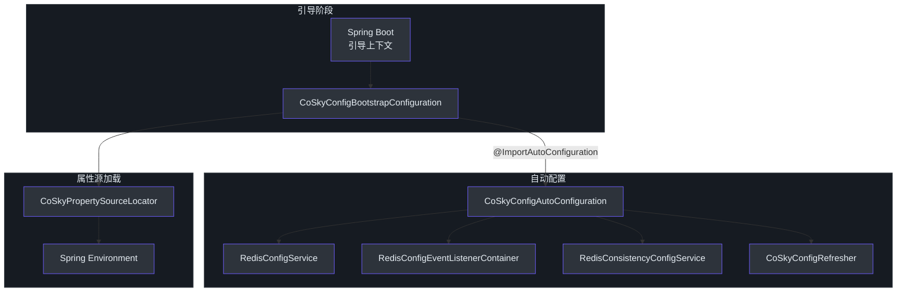
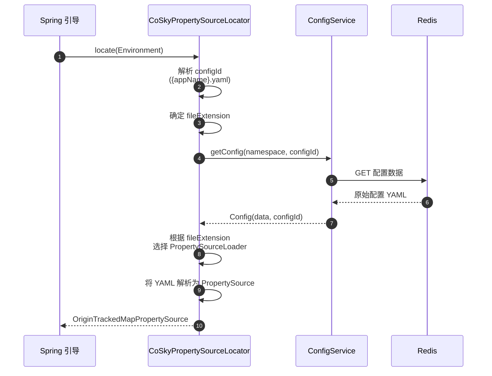
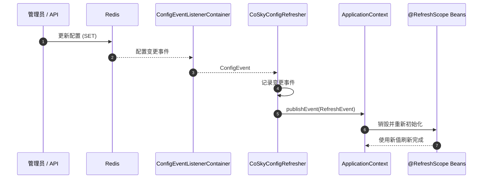
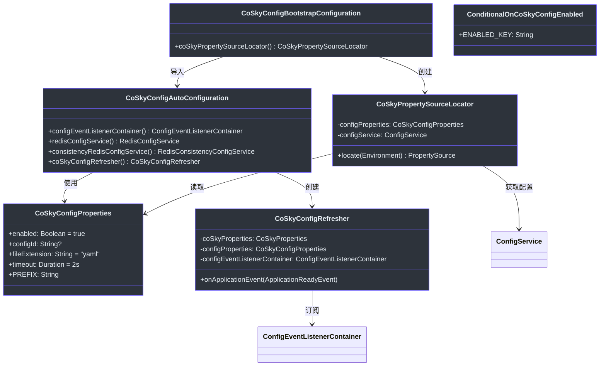

# Spring Cloud Config Starter

CoSky 的 Spring Cloud Config Starter 桥接了 CoSky 基于 Redis 的配置中心与 Spring Cloud Config 模型之间的差距。无需运行独立的配置服务器，服务在 Spring Boot 引导阶段直接从 Redis 获取配置，并且 Redis 中配置的任何变更都会在运行时自动推送到应用程序。这消除了对独立 config-server 部署的需求，同时保留了 Spring 的 `@RefreshScope` 和 `PropertySource` 抽象的完整功能。

## 一览

| 组件 | 职责 | 关键文件 | 源码 |
|---|---|---|---|
| **CoSkyConfigProperties** | 绑定 `spring.cloud.cosky.config.*` 属性 | `CoSkyConfigProperties.kt` | [cosky-spring-cloud-starter-config/.../CoSkyConfigProperties.kt:25](https://github.com/Ahoo-Wang/CoSky/blob/main/cosky-spring-cloud-starter-config/src/main/kotlin/me/ahoo/cosky/config/spring/cloud/CoSkyConfigProperties.kt#L25) |
| **CoSkyConfigBootstrapConfiguration** | 引导入口；创建 `PropertySourceLocator` | `CoSkyConfigBootstrapConfiguration.kt` | [cosky-spring-cloud-starter-config/.../CoSkyConfigBootstrapConfiguration.kt:27](https://github.com/Ahoo-Wang/CoSky/blob/main/cosky-spring-cloud-starter-config/src/main/kotlin/me/ahoo/cosky/config/spring/cloud/CoSkyConfigBootstrapConfiguration.kt#L27) |
| **CoSkyConfigAutoConfiguration** | 装配 `ConfigService`、事件监听器和刷新器 Bean | `CoSkyConfigAutoConfiguration.kt` | [cosky-spring-cloud-starter-config/.../CoSkyConfigAutoConfiguration.kt:43](https://github.com/Ahoo-Wang/CoSky/blob/main/cosky-spring-cloud-starter-config/src/main/kotlin/me/ahoo/cosky/config/spring/cloud/CoSkyConfigAutoConfiguration.kt#L43) |
| **CoSkyPropertySourceLocator** | 从 Redis 加载配置到 Spring `Environment` | `CoSkyPropertySourceLocator.kt` | [cosky-spring-cloud-starter-config/.../CoSkyPropertySourceLocator.kt:35](https://github.com/Ahoo-Wang/CoSky/blob/main/cosky-spring-cloud-starter-config/src/main/kotlin/me/ahoo/cosky/config/spring/cloud/CoSkyPropertySourceLocator.kt#L35) |
| **CoSkyConfigRefresher** | 监听配置变更并触发 Spring `RefreshEvent` | `CoSkyConfigRefresher.kt` | [cosky-spring-cloud-starter-config/.../refresh/CoSkyConfigRefresher.kt:33](https://github.com/Ahoo-Wang/CoSky/blob/main/cosky-spring-cloud-starter-config/src/main/kotlin/me/ahoo/cosky/config/spring/cloud/refresh/CoSkyConfigRefresher.kt#L33) |
| **ConditionalOnCoSkyConfigEnabled** | 基于 `enabled` 属性的条件激活 | `ConditionalOnCoSkyConfigEnabled.kt` | [cosky-spring-cloud-starter-config/.../ConditionalOnCoSkyConfigEnabled.kt:29](https://github.com/Ahoo-Wang/CoSky/blob/main/cosky-spring-cloud-starter-config/src/main/kotlin/me/ahoo/cosky/config/spring/cloud/ConditionalOnCoSkyConfigEnabled.kt#L29) |

## 配置属性

所有属性都在 `spring.cloud.cosky.config` 前缀下，由 [CoSkyConfigProperties.kt:24](https://github.com/Ahoo-Wang/CoSky/blob/main/cosky-spring-cloud-starter-config/src/main/kotlin/me/ahoo/cosky/config/spring/cloud/CoSkyConfigProperties.kt#L24) 绑定。

| 属性 | 默认值 | 描述 |
|---|---|---|
| `spring.cloud.cosky.config.enabled` | `true` | 完全启用或禁用 CoSky 配置启动器。 |
| `spring.cloud.cosky.config.config-id` | `${spring.application.name}.yaml` | 用于在 Redis 中查找配置的配置 ID。如果留空，则回退为 `{appName}.{fileExtension}`。 |
| `spring.cloud.cosky.config.file-extension` | `yaml` | 用于选择正确的 Spring `PropertySourceLoader` 的文件扩展名（如 `yaml`、`properties`）。 |
| `spring.cloud.cosky.config.timeout` | `2s` | 对基于 Redis 的 `ConfigService` 的阻塞调用超时时间。 |

## 自动配置链

配置启动器通过两阶段自动配置链激活。在**引导阶段**，首先加载 `CoSkyConfigBootstrapConfiguration`。它导入 `CoSkyConfigAutoConfiguration`，后者装配核心 Bean（`ConfigService`、`ConfigEventListenerContainer`、`CoSkyConfigRefresher`）。引导配置还注册了 Spring Cloud 用于定位外部属性的 `CoSkyPropertySourceLocator` Bean。

每个自动配置类都由 `@ConditionalOnCoSkyConfigEnabled` 注解（[ConditionalOnCoSkyConfigEnabled.kt:24](https://github.com/Ahoo-Wang/CoSky/blob/main/cosky-spring-cloud-starter-config/src/main/kotlin/me/ahoo/cosky/config/spring/cloud/ConditionalOnCoSkyConfigEnabled.kt#L24)）保护，该注解检查 `spring.cloud.cosky.config.enabled` 属性，在未设置时默认为 `true`。


<!-- Sources: cosky-spring-cloud-starter-config/src/main/kotlin/me/ahoo/cosky/config/spring/cloud/CoSkyConfigBootstrapConfiguration.kt:27, cosky-spring-cloud-starter-config/src/main/kotlin/me/ahoo/cosky/config/spring/cloud/CoSkyConfigAutoConfiguration.kt:43 -->

## 配置加载流程

`CoSkyPropertySourceLocator` 实现了 Spring Cloud 的 `PropertySourceLocator` 接口（[CoSkyPropertySourceLocator.kt:38](https://github.com/Ahoo-Wang/CoSky/blob/main/cosky-spring-cloud-starter-config/src/main/kotlin/me/ahoo/cosky/config/spring/cloud/CoSkyPropertySourceLocator.kt#L38)）。在引导阶段，Spring 会对每个已注册的定位器调用 `locate(Environment)`。该定位器：

1. 解析**配置 ID** -- 如果 `configId` 为空，则默认为 `{appName}.{fileExtension}`，如 [CoSkyConfigAutoConfiguration.kt:48](https://github.com/Ahoo-Wang/CoSky/blob/main/cosky-spring-cloud-starter-config/src/main/kotlin/me/ahoo/cosky/config/spring/cloud/CoSkyConfigAutoConfiguration.kt#L48) 所计算。
2. 通过 `ConfigService.getConfig(namespace, configId)` 从 Redis 获取配置数据（[CoSkyPropertySourceLocator.kt:60](https://github.com/Ahoo-Wang/CoSky/blob/main/cosky-spring-cloud-starter-config/src/main/kotlin/me/ahoo/cosky/config/spring/cloud/CoSkyPropertySourceLocator.kt#L60)）。
3. 根据文件扩展名选择合适的 `PropertySourceLoader`（例如 `.yaml` 对应 `YamlPropertySourceLoader`）。
4. 将原始配置数据解析为 `PropertySource` 并添加到 Spring `Environment` 中。


<!-- Sources: cosky-spring-cloud-starter-config/src/main/kotlin/me/ahoo/cosky/config/spring/cloud/CoSkyPropertySourceLocator.kt:50, cosky-spring-cloud-starter-config/src/main/kotlin/me/ahoo/cosky/config/spring/cloud/CoSkyConfigAutoConfiguration.kt:48 -->

## 配置刷新机制

应用程序运行后，Redis 中所做的配置变更会自动传播到应用程序。`CoSkyConfigRefresher`（[CoSkyConfigRefresher.kt:33](https://github.com/Ahoo-Wang/CoSky/blob/main/cosky-spring-cloud-starter-config/src/main/kotlin/me/ahoo/cosky/config/spring/cloud/refresh/CoSkyConfigRefresher.kt#L33)）在 `ApplicationReadyEvent` 触发后订阅 `ConfigEventListenerContainer`。当配置变更事件到达时，它会发布 Spring `RefreshEvent`，从而触发所有 `@RefreshScope` Bean 的重新初始化。


<!-- Sources: cosky-spring-cloud-starter-config/src/main/kotlin/me/ahoo/cosky/config/spring/cloud/refresh/CoSkyConfigRefresher.kt:46, cosky-spring-cloud-starter-config/src/main/kotlin/me/ahoo/cosky/config/spring/cloud/CoSkyConfigAutoConfiguration.kt:84 -->

刷新器在 [CoSkyConfigAutoConfiguration.kt:84](https://github.com/Ahoo-Wang/CoSky/blob/main/cosky-spring-cloud-starter-config/src/main/kotlin/me/ahoo/cosky/config/spring/cloud/CoSkyConfigAutoConfiguration.kt#L84) 中装配为 Bean。它使用 `AtomicBoolean` 保护（[CoSkyConfigRefresher.kt:39](https://github.com/Ahoo-Wang/CoSky/blob/main/cosky-spring-cloud-starter-config/src/main/kotlin/me/ahoo/cosky/config/spring/cloud/refresh/CoSkyConfigRefresher.kt#L39)）确保订阅只建立一次，即使触发了多个 `ApplicationReadyEvent` 实例。

## 类图


<!-- Sources: cosky-spring-cloud-starter-config/src/main/kotlin/me/ahoo/cosky/config/spring/cloud/CoSkyConfigProperties.kt:25, cosky-spring-cloud-starter-config/src/main/kotlin/me/ahoo/cosky/config/spring/cloud/CoSkyConfigAutoConfiguration.kt:43, cosky-spring-cloud-starter-config/src/main/kotlin/me/ahoo/cosky/config/spring/cloud/CoSkyConfigBootstrapConfiguration.kt:27, cosky-spring-cloud-starter-config/src/main/kotlin/me/ahoo/cosky/config/spring/cloud/CoSkyPropertySourceLocator.kt:35, cosky-spring-cloud-starter-config/src/main/kotlin/me/ahoo/cosky/config/spring/cloud/refresh/CoSkyConfigRefresher.kt:33, cosky-spring-cloud-starter-config/src/main/kotlin/me/ahoo/cosky/config/spring/cloud/ConditionalOnCoSkyConfigEnabled.kt:29 -->

## YAML 配置示例

```yaml
spring:
  application:
    name: order-service
  cloud:
    cosky:
      namespace: production
      config:
        enabled: true
        config-id: order-service.yaml   # 可选；默认为 ${spring.application.name}.yaml
        file-extension: yaml            # yaml 或 properties
        timeout: 2s
```

使用以上配置，CoSky 将：

1. 在引导阶段，从 `production` 命名空间下的 Redis 中获取 `order-service.yaml` 配置。
2. 解析 YAML 并将其作为属性源注入到 Spring `Environment` 中。
3. 在运行时监听 `order-service.yaml` 的变更，并自动刷新 `@RefreshScope` Bean。

## 相关页面

- [Spring Cloud Discovery Starter](/guide/spring-cloud-discovery) -- 基于 Redis 的服务注册与发现
- [Configuration Center](/guide/config) -- CoSky 的配置管理 API 和 Redis 存储模型

## 参考

- [CoSkyConfigAutoConfiguration.kt](https://github.com/Ahoo-Wang/CoSky/blob/main/cosky-spring-cloud-starter-config/src/main/kotlin/me/ahoo/cosky/config/spring/cloud/CoSkyConfigAutoConfiguration.kt)
- [CoSkyConfigBootstrapConfiguration.kt](https://github.com/Ahoo-Wang/CoSky/blob/main/cosky-spring-cloud-starter-config/src/main/kotlin/me/ahoo/cosky/config/spring/cloud/CoSkyConfigBootstrapConfiguration.kt)
- [CoSkyPropertySourceLocator.kt](https://github.com/Ahoo-Wang/CoSky/blob/main/cosky-spring-cloud-starter-config/src/main/kotlin/me/ahoo/cosky/config/spring/cloud/CoSkyPropertySourceLocator.kt)
- [CoSkyConfigProperties.kt](https://github.com/Ahoo-Wang/CoSky/blob/main/cosky-spring-cloud-starter-config/src/main/kotlin/me/ahoo/cosky/config/spring/cloud/CoSkyConfigProperties.kt)
- [CoSkyConfigRefresher.kt](https://github.com/Ahoo-Wang/CoSky/blob/main/cosky-spring-cloud-starter-config/src/main/kotlin/me/ahoo/cosky/config/spring/cloud/refresh/CoSkyConfigRefresher.kt)
- [ConditionalOnCoSkyConfigEnabled.kt](https://github.com/Ahoo-Wang/CoSky/blob/main/cosky-spring-cloud-starter-config/src/main/kotlin/me/ahoo/cosky/config/spring/cloud/ConditionalOnCoSkyConfigEnabled.kt)
