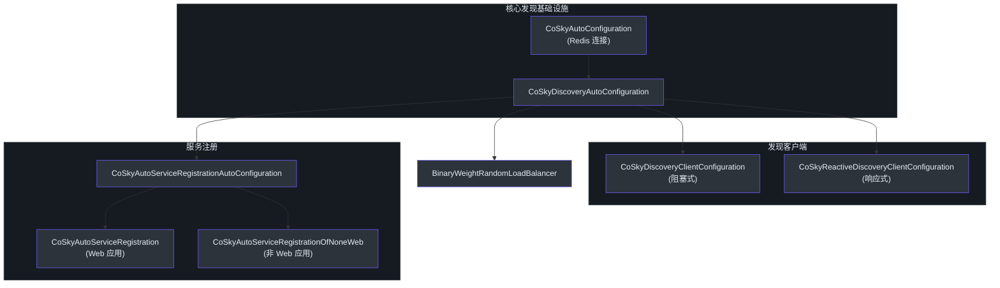
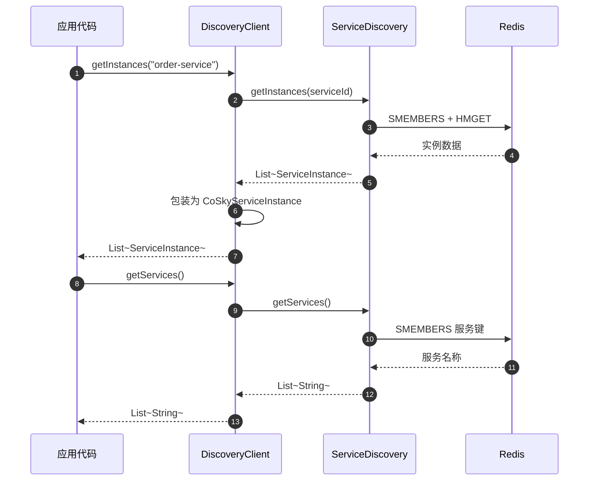
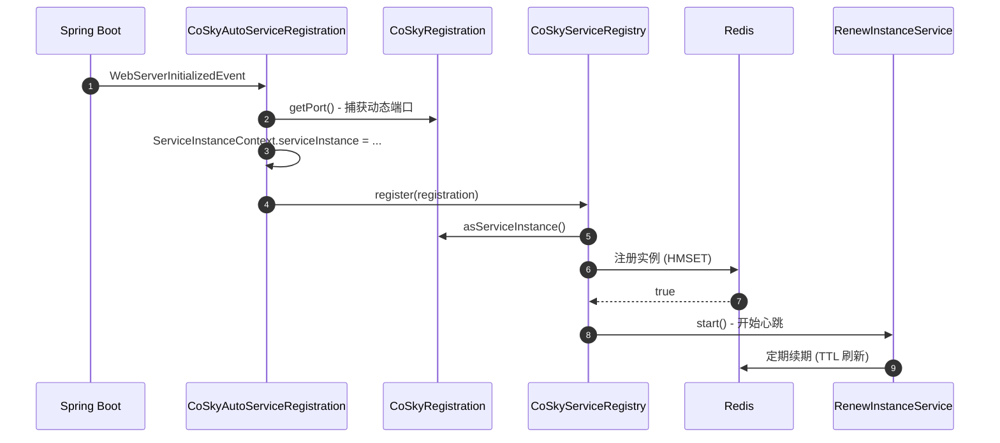
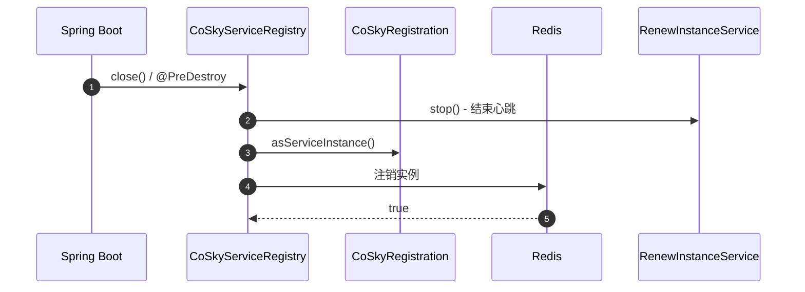
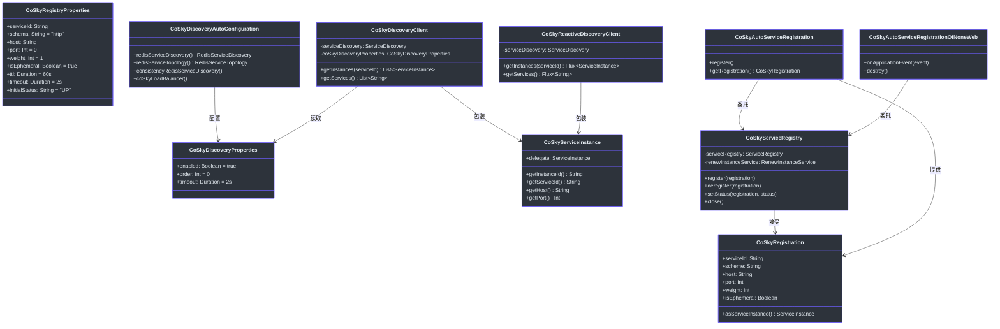

# Spring Cloud Discovery Starter

CoSky Spring Cloud Discovery Starter 提供了 CoSky 基于 Redis 的服务注册中心与 Spring Cloud Discovery 模型之间的无缝集成。它同时提供阻塞式（`DiscoveryClient`）和响应式（`ReactiveDiscoveryClient`）实现、带心跳续期的自动服务注册以及加权负载均衡器 -- 所有这些都不需要运行独立的发现服务器。服务在启动时将自己注册到 Redis，通过 Redis 查询互相发现，并在关闭时自动注销。

## 一览

| 组件 | 职责 | 关键文件 | 源码 |
|---|---|---|---|
| **CoSkyDiscoveryAutoConfiguration** | 装配核心发现 Bean（服务发现、拓扑、事件监听器、负载均衡器） | `CoSkyDiscoveryAutoConfiguration.kt` | [cosky-spring-cloud-starter-discovery/.../CoSkyDiscoveryAutoConfiguration.kt:47](https://github.com/Ahoo-Wang/CoSky/blob/main/cosky-spring-cloud-starter-discovery/src/main/kotlin/me/ahoo/cosky/discovery/spring/cloud/discovery/CoSkyDiscoveryAutoConfiguration.kt#L47) |
| **CoSkyDiscoveryClient** | 阻塞式 `DiscoveryClient` 适配器 | `CoSkyDiscoveryClient.kt` | [cosky-spring-cloud-starter-discovery/.../CoSkyDiscoveryClient.kt:24](https://github.com/Ahoo-Wang/CoSky/blob/main/cosky-spring-cloud-starter-discovery/src/main/kotlin/me/ahoo/cosky/discovery/spring/cloud/discovery/CoSkyDiscoveryClient.kt#L24) |
| **CoSkyReactiveDiscoveryClient** | 响应式 `ReactiveDiscoveryClient` 适配器 | `CoSkyReactiveDiscoveryClient.kt` | [cosky-spring-cloud-starter-discovery/.../CoSkyReactiveDiscoveryClient.kt:26](https://github.com/Ahoo-Wang/CoSky/blob/main/cosky-spring-cloud-starter-discovery/src/main/kotlin/me/ahoo/cosky/discovery/spring/cloud/discovery/CoSkyReactiveDiscoveryClient.kt#L26) |
| **CoSkyServiceRegistry** | 通过 Redis 注册和注销实例 | `CoSkyServiceRegistry.kt` | [cosky-spring-cloud-starter-discovery/.../CoSkyServiceRegistry.kt:25](https://github.com/Ahoo-Wang/CoSky/blob/main/cosky-spring-cloud-starter-discovery/src/main/kotlin/me/ahoo/cosky/discovery/spring/cloud/registry/CoSkyServiceRegistry.kt#L25) |
| **CoSkyRegistration** | 持有用于注册的服务实例元数据 | `CoSkyRegistration.kt` | [cosky-spring-cloud-starter-discovery/.../CoSkyRegistration.kt:26](https://github.com/Ahoo-Wang/CoSky/blob/main/cosky-spring-cloud-starter-discovery/src/main/kotlin/me/ahoo/cosky/discovery/spring/cloud/registry/CoSkyRegistration.kt#L26) |
| **CoSkyAutoServiceRegistration** | Web 应用自动注册（从内嵌服务器获取端口） | `CoSkyAutoServiceRegistration.kt` | [cosky-spring-cloud-starter-discovery/.../CoSkyAutoServiceRegistration.kt:25](https://github.com/Ahoo-Wang/CoSky/blob/main/cosky-spring-cloud-starter-discovery/src/main/kotlin/me/ahoo/cosky/discovery/spring/cloud/registry/CoSkyAutoServiceRegistration.kt#L25) |
| **CoSkyAutoServiceRegistrationOfNoneWeb** | 非 Web 应用自动注册（使用 PID 作为端口） | `CoSkyAutoServiceRegistrationOfNoneWeb.kt` | [cosky-spring-cloud-starter-discovery/.../CoSkyAutoServiceRegistrationOfNoneWeb.kt:31](https://github.com/Ahoo-Wang/CoSky/blob/main/cosky-spring-cloud-starter-discovery/src/main/kotlin/me/ahoo/cosky/discovery/spring/cloud/registry/CoSkyAutoServiceRegistrationOfNoneWeb.kt#L31) |

## 配置属性

### 发现属性

由 [CoSkyDiscoveryProperties.kt:24](https://github.com/Ahoo-Wang/CoSky/blob/main/cosky-spring-cloud-starter-discovery/src/main/kotlin/me/ahoo/cosky/discovery/spring/cloud/discovery/CoSkyDiscoveryProperties.kt#L24) 绑定，前缀为 `spring.cloud.cosky.discovery`。

| 属性 | 默认值 | 描述 |
|---|---|---|
| `spring.cloud.cosky.discovery.enabled` | `true` | 启用或禁用 CoSky 发现启动器。 |
| `spring.cloud.cosky.discovery.order` | `0` | 组合链中发现客户端的顺序。 |
| `spring.cloud.cosky.discovery.timeout` | `2s` | 阻塞式发现操作的超时时间。 |

### 注册属性

由 [CoSkyRegistryProperties.kt:27](https://github.com/Ahoo-Wang/CoSky/blob/main/cosky-spring-cloud-starter-discovery/src/main/kotlin/me/ahoo/cosky/discovery/spring/cloud/registry/CoSkyRegistryProperties.kt#L27) 绑定，前缀为 `spring.cloud.cosky.discovery.registry`。

| 属性 | 默认值 | 描述 |
|---|---|---|
| `spring.cloud.cosky.discovery.registry.service-id` | `${spring.application.name}` | 用于注册的服务名称。回退为应用程序名称。 |
| `spring.cloud.cosky.discovery.registry.schema` | `http` | 协议方案（`http` 或 `https`）。 |
| `spring.cloud.cosky.discovery.registry.host` | 自动检测 | 主机 IP 地址。如果为空，通过 `InetUtils` 自动检测。 |
| `spring.cloud.cosky.discovery.registry.port` | `0` | 服务端口。对于 Web 应用，从内嵌服务器自动检测。 |
| `spring.cloud.cosky.discovery.registry.weight` | `1` | 用于加权负载均衡的实例权重。 |
| `spring.cloud.cosky.discovery.registry.is-ephemeral` | `true` | 实例是否为临时实例（需要心跳续期）。 |
| `spring.cloud.cosky.discovery.registry.ttl` | `60s` | 实例的存活时间；必须在过期前续期。 |
| `spring.cloud.cosky.discovery.registry.timeout` | `2s` | 阻塞式注册操作的超时时间。 |
| `spring.cloud.cosky.discovery.registry.initial-status` | `UP` | 初始实例状态（`UP` 或 `OUT_OF_SERVICE`）。 |
| `spring.cloud.service-registry.auto-registration.enabled` | `true` | 启用或禁用自动注册。 |

## 自动配置链

发现启动器使用分层自动配置方法。`CoSkyDiscoveryAutoConfiguration` 装配核心基础设施 Bean（基于 Redis 的服务发现、事件监听器、负载均衡器）。然后，根据应用程序类型，由 `CoSkyDiscoveryClientConfiguration` 或 `CoSkyReactiveDiscoveryClientConfiguration` 提供相应的 Spring Cloud 发现客户端。最后，`CoSkyAutoServiceRegistrationAutoConfiguration` 处理服务注册。


<!-- Sources: cosky-spring-cloud-starter-discovery/src/main/kotlin/me/ahoo/cosky/discovery/spring/cloud/discovery/CoSkyDiscoveryAutoConfiguration.kt:47, cosky-spring-cloud-starter-discovery/src/main/kotlin/me/ahoo/cosky/discovery/spring/cloud/discovery/CoSkyDiscoveryClientConfiguration.kt:36, cosky-spring-cloud-starter-discovery/src/main/kotlin/me/ahoo/cosky/discovery/spring/cloud/discovery/CoSkyReactiveDiscoveryClientConfiguration.kt:35, cosky-spring-cloud-starter-discovery/src/main/kotlin/me/ahoo/cosky/discovery/spring/cloud/registry/CoSkyAutoServiceRegistrationAutoConfiguration.kt:43 -->

## 发现客户端

CoSky 提供两种发现客户端实现，将 CoSky `ServiceDiscovery` API 适配为 Spring Cloud 接口。

### 阻塞式：CoSkyDiscoveryClient

[CoSkyDiscoveryClient](https://github.com/Ahoo-Wang/CoSky/blob/main/cosky-spring-cloud-starter-discovery/src/main/kotlin/me/ahoo/cosky/discovery/spring/cloud/discovery/CoSkyDiscoveryClient.kt) 实现了 Spring 的 `DiscoveryClient`。它委托给响应式 `ServiceDiscovery` 并使用配置的超时时间进行阻塞（[CoSkyDiscoveryClient.kt:33](https://github.com/Ahoo-Wang/CoSky/blob/main/cosky-spring-cloud-starter-discovery/src/main/kotlin/me/ahoo/cosky/discovery/spring/cloud/discovery/CoSkyDiscoveryClient.kt#L33)）。来自 CoSky 的每个 `ServiceInstance` 都被包装在 `CoSkyServiceInstance` 适配器中。

### 响应式：CoSkyReactiveDiscoveryClient

[CoSkyReactiveDiscoveryClient](https://github.com/Ahoo-Wang/CoSky/blob/main/cosky-spring-cloud-starter-discovery/src/main/kotlin/me/ahoo/cosky/discovery/spring/cloud/discovery/CoSkyReactiveDiscoveryClient.kt) 实现了 `ReactiveDiscoveryClient`，直接返回 `Flux<ServiceInstance>` 而不阻塞（[CoSkyReactiveDiscoveryClient.kt:32](https://github.com/Ahoo-Wang/CoSky/blob/main/cosky-spring-cloud-starter-discovery/src/main/kotlin/me/ahoo/cosky/discovery/spring/cloud/discovery/CoSkyReactiveDiscoveryClient.kt#L32)）。

### CoSkyServiceInstance 适配器

[CoSkyServiceInstance](https://github.com/Ahoo-Wang/CoSky/blob/main/cosky-spring-cloud-starter-discovery/src/main/kotlin/me/ahoo/cosky/discovery/spring/cloud/discovery/CoSkyServiceInstance.kt) 是一个简单的数据类，包装 CoSky 的 `ServiceInstance` 并将其适配为 Spring Cloud 的 `ServiceInstance` 接口，映射 `instanceId`、`serviceId`、`host`、`port`、`isSecure`、`uri`、`metadata` 和 `scheme`（[CoSkyServiceInstance.kt:23](https://github.com/Ahoo-Wang/CoSky/blob/main/cosky-spring-cloud-starter-discovery/src/main/kotlin/me/ahoo/cosky/discovery/spring/cloud/discovery/CoSkyServiceInstance.kt#L23)）。

### 服务发现查询流程


<!-- Sources: cosky-spring-cloud-starter-discovery/src/main/kotlin/me/ahoo/cosky/discovery/spring/cloud/discovery/CoSkyDiscoveryClient.kt:32, cosky-spring-cloud-starter-discovery/src/main/kotlin/me/ahoo/cosky/discovery/spring/cloud/discovery/CoSkyReactiveDiscoveryClient.kt:32, cosky-spring-cloud-starter-discovery/src/main/kotlin/me/ahoo/cosky/discovery/spring/cloud/discovery/CoSkyServiceInstance.kt:23 -->

## 服务注册

### CoSkyServiceRegistry

[CoSkyServiceRegistry](https://github.com/Ahoo-Wang/CoSky/blob/main/cosky-spring-cloud-starter-discovery/src/main/kotlin/me/ahoo/cosky/discovery/spring/cloud/registry/CoSkyServiceRegistry.kt) 实现了 Spring 的 `ServiceRegistry<CoSkyRegistration>` 接口。在 `register()` 时，它委托给 CoSky `ServiceRegistry` 将实例持久化到 Redis，然后启动心跳 `RenewInstanceService`（[CoSkyServiceRegistry.kt:30](https://github.com/Ahoo-Wang/CoSky/blob/main/cosky-spring-cloud-starter-discovery/src/main/kotlin/me/ahoo/cosky/discovery/spring/cloud/registry/CoSkyServiceRegistry.kt#L30)）。在 `deregister()` 时，它移除实例并停止心跳。`close()` 方法也会停止续期服务（[CoSkyServiceRegistry.kt:45](https://github.com/Ahoo-Wang/CoSky/blob/main/cosky-spring-cloud-starter-discovery/src/main/kotlin/me/ahoo/cosky/discovery/spring/cloud/registry/CoSkyServiceRegistry.kt#L45)）。

### CoSkyRegistration

[CoSkyRegistration](https://github.com/Ahoo-Wang/CoSky/blob/main/cosky-spring-cloud-starter-discovery/src/main/kotlin/me/ahoo/cosky/discovery/spring/cloud/registry/CoSkyRegistration.kt) 实现了 Spring 的 `Registration` 接口。它携带注册所需的 `serviceId`、`scheme`、`host`、`port`、`weight`、`isEphemeral` 和 `metadata`（[CoSkyRegistration.kt:26](https://github.com/Ahoo-Wang/CoSky/blob/main/cosky-spring-cloud-starter-discovery/src/main/kotlin/me/ahoo/cosky/discovery/spring/cloud/registry/CoSkyRegistration.kt#L26)）。`asServiceInstance()` 方法将其转换为适合注册调用的 CoSky `ServiceInstance`。

### Web 应用自动注册

[CoSkyAutoServiceRegistration](https://github.com/Ahoo-Wang/CoSky/blob/main/cosky-spring-cloud-starter-discovery/src/main/kotlin/me/ahoo/cosky/discovery/spring/cloud/registry/CoSkyAutoServiceRegistration.kt) 继承 `AbstractAutoServiceRegistration`。当内嵌 Web 服务器启动时，它捕获动态分配的端口并调用 `register()`（[CoSkyAutoServiceRegistration.kt:48](https://github.com/Ahoo-Wang/CoSky/blob/main/cosky-spring-cloud-starter-discovery/src/main/kotlin/me/ahoo/cosky/discovery/spring/cloud/registry/CoSkyAutoServiceRegistration.kt#L48)）。它还将实例存储在 `ServiceInstanceContext` 中供下游使用。

### 非 Web 应用自动注册

[CoSkyAutoServiceRegistrationOfNoneWeb](https://github.com/Ahoo-Wang/CoSky/blob/main/cosky-spring-cloud-starter-discovery/src/main/kotlin/me/ahoo/cosky/discovery/spring/cloud/registry/CoSkyAutoServiceRegistrationOfNoneWeb.kt) 处理非 Web 应用程序（如 gRPC 服务、CLI 工具）。它监听 `ApplicationStartedEvent`，如果应用程序上下文不是 `WebServerApplicationContext`，则使用**进程 ID（PID）作为端口**注册服务（[CoSkyAutoServiceRegistrationOfNoneWeb.kt:51](https://github.com/Ahoo-Wang/CoSky/blob/main/cosky-spring-cloud-starter-discovery/src/main/kotlin/me/ahoo/cosky/discovery/spring/cloud/registry/CoSkyAutoServiceRegistrationOfNoneWeb.kt#L51)）。即使没有 HTTP 端口，这也提供了一个有意义的标识符。

### 服务注册流程


<!-- Sources: cosky-spring-cloud-starter-discovery/src/main/kotlin/me/ahoo/cosky/discovery/spring/cloud/registry/CoSkyAutoServiceRegistration.kt:48, cosky-spring-cloud-starter-discovery/src/main/kotlin/me/ahoo/cosky/discovery/spring/cloud/registry/CoSkyServiceRegistry.kt:30, cosky-spring-cloud-starter-discovery/src/main/kotlin/me/ahoo/cosky/discovery/spring/cloud/registry/CoSkyRegistration.kt:36 -->

### 服务注销流程


<!-- Sources: cosky-spring-cloud-starter-discovery/src/main/kotlin/me/ahoo/cosky/discovery/spring/cloud/registry/CoSkyServiceRegistry.kt:45, cosky-spring-cloud-starter-discovery/src/main/kotlin/me/ahoo/cosky/discovery/spring/cloud/registry/CoSkyServiceRegistry.kt:38 -->

## 一致性层

发现启动器使用 `ConsistencyRedisServiceDiscovery` 作为主要的 `ServiceDiscovery` Bean（[CoSkyDiscoveryAutoConfiguration.kt:81](https://github.com/Ahoo-Wang/CoSky/blob/main/cosky-spring-cloud-starter-discovery/src/main/kotlin/me/ahoo/cosky/discovery/spring/cloud/discovery/CoSkyDiscoveryAutoConfiguration.kt#L81)）。此装饰器通过订阅以下事件，用本地一致性保证包装 `RedisServiceDiscovery`：

- **ServiceEventListenerContainer** -- 监听 Redis Pub/Sub 事件，当服务被添加或移除时触发（[CoSkyDiscoveryAutoConfiguration.kt:62](https://github.com/Ahoo-Wang/CoSky/blob/main/cosky-spring-cloud-starter-discovery/src/main/kotlin/me/ahoo/cosky/discovery/spring/cloud/discovery/CoSkyDiscoveryAutoConfiguration.kt#L62)）。
- **InstanceEventListenerContainer** -- 监听 Redis Pub/Sub 事件，当单个实例发生变化（注册、注销、元数据更新）时触发（[CoSkyDiscoveryAutoConfiguration.kt:69](https://github.com/Ahoo-Wang/CoSky/blob/main/cosky-spring-cloud-starter-discovery/src/main/kotlin/me/ahoo/cosky/discovery/spring/cloud/discovery/CoSkyDiscoveryAutoConfiguration.kt#L69)）。

这种事件驱动的方式确保本地服务缓存被及时失效和刷新，而不依赖轮询。

## 负载均衡器集成

CoSky 提供了自定义的 `BinaryWeightRandomLoadBalancer`（[CoSkyDiscoveryAutoConfiguration.kt:106](https://github.com/Ahoo-Wang/CoSky/blob/main/cosky-spring-cloud-starter-discovery/src/main/kotlin/me/ahoo/cosky/discovery/spring/cloud/discovery/CoSkyDiscoveryAutoConfiguration.kt#L106)），支持每实例权重。它使用在累积权重数组上的二分搜索算法，实现 O(log n) 的实例选择。负载均衡器继承 `AbstractLoadBalancer`，并在 `InstanceEventListenerContainer` 报告实例列表变更时重建其选择器。

## 类图


<!-- Sources: cosky-spring-cloud-starter-discovery/src/main/kotlin/me/ahoo/cosky/discovery/spring/cloud/discovery/CoSkyDiscoveryProperties.kt:24, cosky-spring-cloud-starter-discovery/src/main/kotlin/me/ahoo/cosky/discovery/spring/cloud/registry/CoSkyRegistryProperties.kt:27, cosky-spring-cloud-starter-discovery/src/main/kotlin/me/ahoo/cosky/discovery/spring/cloud/discovery/CoSkyDiscoveryAutoConfiguration.kt:47, cosky-spring-cloud-starter-discovery/src/main/kotlin/me/ahoo/cosky/discovery/spring/cloud/discovery/CoSkyDiscoveryClient.kt:24, cosky-spring-cloud-starter-discovery/src/main/kotlin/me/ahoo/cosky/discovery/spring/cloud/discovery/CoSkyServiceInstance.kt:23, cosky-spring-cloud-starter-discovery/src/main/kotlin/me/ahoo/cosky/discovery/spring/cloud/registry/CoSkyServiceRegistry.kt:25, cosky-spring-cloud-starter-discovery/src/main/kotlin/me/ahoo/cosky/discovery/spring/cloud/registry/CoSkyRegistration.kt:26, cosky-spring-cloud-starter-discovery/src/main/kotlin/me/ahoo/cosky/discovery/spring/cloud/registry/CoSkyAutoServiceRegistration.kt:25, cosky-spring-cloud-starter-discovery/src/main/kotlin/me/ahoo/cosky/discovery/spring/cloud/registry/CoSkyAutoServiceRegistrationOfNoneWeb.kt:31 -->

## 完整 YAML 配置示例

```yaml
spring:
  application:
    name: order-service
  cloud:
    cosky:
      namespace: production
      discovery:
        enabled: true
        order: 0
        timeout: 2s
        registry:
          service-id: order-service        # 默认为 spring.application.name
          schema: http
          host: ""                          # 通过 InetUtils 自动检测
          port: 0                           # Web 应用自动检测
          weight: 1
          is-ephemeral: true
          ttl: 60s
          timeout: 2s
          initial-status: UP
          metadata:
            version: "2.0.0"
            region: "us-east-1"
    service-registry:
      auto-registration:
        enabled: true
```

使用以上配置，`order-service` 将：

1. 在启动时将自己注册到 `production` 命名空间下的 Redis 中。
2. 启动心跳续期以保持实例存活（TTL = 60s）。
3. 可被其他服务通过阻塞式或响应式发现客户端发现。
4. 支持权重为 1 的加权负载均衡。

## 相关页面

- [Spring Cloud Config Starter](/guide/spring-cloud-config) -- 基于 Redis 的配置管理，支持实时刷新
- [Service Discovery](/guide/discovery) -- CoSky 核心服务发现 API 和 Redis 数据模型
- [Service Registry](/guide/registry) -- CoSky 的服务注册和心跳机制

## 参考

- [CoSkyDiscoveryAutoConfiguration.kt](https://github.com/Ahoo-Wang/CoSky/blob/main/cosky-spring-cloud-starter-discovery/src/main/kotlin/me/ahoo/cosky/discovery/spring/cloud/discovery/CoSkyDiscoveryAutoConfiguration.kt)
- [CoSkyDiscoveryClient.kt](https://github.com/Ahoo-Wang/CoSky/blob/main/cosky-spring-cloud-starter-discovery/src/main/kotlin/me/ahoo/cosky/discovery/spring/cloud/discovery/CoSkyDiscoveryClient.kt)
- [CoSkyReactiveDiscoveryClient.kt](https://github.com/Ahoo-Wang/CoSky/blob/main/cosky-spring-cloud-starter-discovery/src/main/kotlin/me/ahoo/cosky/discovery/spring/cloud/discovery/CoSkyReactiveDiscoveryClient.kt)
- [CoSkyServiceInstance.kt](https://github.com/Ahoo-Wang/CoSky/blob/main/cosky-spring-cloud-starter-discovery/src/main/kotlin/me/ahoo/cosky/discovery/spring/cloud/discovery/CoSkyServiceInstance.kt)
- [CoSkyServiceRegistry.kt](https://github.com/Ahoo-Wang/CoSky/blob/main/cosky-spring-cloud-starter-discovery/src/main/kotlin/me/ahoo/cosky/discovery/spring/cloud/registry/CoSkyServiceRegistry.kt)
- [CoSkyRegistration.kt](https://github.com/Ahoo-Wang/CoSky/blob/main/cosky-spring-cloud-starter-discovery/src/main/kotlin/me/ahoo/cosky/discovery/spring/cloud/registry/CoSkyRegistration.kt)
- [CoSkyAutoServiceRegistration.kt](https://github.com/Ahoo-Wang/CoSky/blob/main/cosky-spring-cloud-starter-discovery/src/main/kotlin/me/ahoo/cosky/discovery/spring/cloud/registry/CoSkyAutoServiceRegistration.kt)
- [CoSkyAutoServiceRegistrationOfNoneWeb.kt](https://github.com/Ahoo-Wang/CoSky/blob/main/cosky-spring-cloud-starter-discovery/src/main/kotlin/me/ahoo/cosky/discovery/spring/cloud/registry/CoSkyAutoServiceRegistrationOfNoneWeb.kt)
- [CoSkyAutoServiceRegistrationAutoConfiguration.kt](https://github.com/Ahoo-Wang/CoSky/blob/main/cosky-spring-cloud-starter-discovery/src/main/kotlin/me/ahoo/cosky/discovery/spring/cloud/registry/CoSkyAutoServiceRegistrationAutoConfiguration.kt)
- [CoSkyRegistryProperties.kt](https://github.com/Ahoo-Wang/CoSky/blob/main/cosky-spring-cloud-starter-discovery/src/main/kotlin/me/ahoo/cosky/discovery/spring/cloud/registry/CoSkyRegistryProperties.kt)
- [CoSkyDiscoveryProperties.kt](https://github.com/Ahoo-Wang/CoSky/blob/main/cosky-spring-cloud-starter-discovery/src/main/kotlin/me/ahoo/cosky/discovery/spring/cloud/discovery/CoSkyDiscoveryProperties.kt)
